# Usisivači i uređaji za čišćenje — pregled ponude i preporuka za kupovinu

Slike iz prodavnica (Lidl letak, Gigatron, Tehnomanija), razvrstane po kategorijama,
dopunjene podacima proizvođača i nezavisnim recenzijama sa interneta.

⚠️ **Slike su snimane u različitim mesecima I u različitim prodavnicama.** Zato se cene sa dve različite nalepnice **ne smeju čitati kao promena cene kroz vreme** — mogu biti i razlika između trgovaca. Pouzdano je samo poređenje brojeva sa **iste** nalepnice (vidi tabelu A ispod).

**Cilj:** uporediti opcije i odlučiti šta kupiti.
Cene sa slika: **avgust/septembar 2026**. Kurs korišćen za poređenje: ~117 RSD/EUR.
**Ažurirano 4.9.2026** — dodato 16 modela sa deklaracija (Rowenta, Gorenje, Hisense, VOX, Kärcher), Midea X6 sa sajta Tehnomanije, i **sekcija 6** sa pretragom tržišta za 3u1 mokro-suve perače poda do 30.000 din.

```
proizvodi/
├── 01-stapni-usisivaci/                     (suvo usisavanje)
├── 02-ciscenje-tapaciranog-namestaja/       (mokra ekstrakcija tekstila)
├── 03-pranje-i-ribanje-poda/                (mokro pranje tvrdih podova)
├── 04-usisivaci-sa-posudom/                 (suvo, sa kablom)
└── 05-usisivaci-za-suvo-i-mokro-usisavanje/ (usisavanje tečnosti — NE pranje poda)
```

---

## Zaključak — šta kupiti

### ⚠️ Prvo pročitati: „TOP PONUDA" cene nisu ono što izgledaju

Slike su snimane **u različitim mesecima i u različitim prodavnicama**, pa se dva tipa poređenja moraju držati odvojeno.

#### A) Poređenje unutar jedne deklaracije — pouzdano

Ovo su brojevi sa **iste nalepnice**, pa ne zavise ni od prodavnice ni od datuma. Svaka deklaracija po zakonu navodi „najnižu cenu u prethodnih 30 dana" — ako je akcijska cena **iznad** nje, to nije akcija.

| Model | Akcijska cena | Najniža u 30 dana (ista nalepnica) | Presuda |
|---|---|---|---|
| ❌ **Midea 2u1 X6** (najgori u listi) | 19.099 | **12.077** | ❌ **7.022 din SKUPLJE (+58 %)** od sopstvenog minimuma — najveći raskorak u dokumentu; uz to **nije dostupan** |
| **Rowenta RH9AD1WO** (2u1 mop) | 56.399 | **47.058** | ❌ **9.341 din SKUPLJE** od sopstvenog minimuma, uz reklamiranu „uštedu od 40.541 din" |
| **Rowenta RH2038WO** | 28.999 | 27.058 | ❌ **1.941 din skuplje** od sopstvenog minimuma |
| VOX A06R | 11.699 | 11.764 | ⚠️ ušteda 65 din |
| VOX A18G | 12.799 | 12.940 | ⚠️ ušteda 141 din |
| 🏆 **Rowenta RH6A75WO** | 16.399 | 18.940 | ✅ **2.541 din ispod** minimuma — stvarna akcija |
| Gorenje SVC 252420 FFA | 17.799 | 20.822 | ✅ 3.023 ispod |
| Gorenje SC 1200 W | 9.799 | 11.528 | ✅ 1.729 ispod |
| Rowenta IN3021F0 | 13.999 | 16.469 | ✅ 2.470 ispod |
| Gorenje SVC 259400 NES | 15.699 | 17.635 | ✅ 1.936 ispod |
| Rowenta RO4B75EA | 16.999 | 18.822 | ✅ 1.823 ispod |
| Rowenta IN5020F0 | 21.099 | 23.528 | ✅ 2.429 ispod |

**Ovo je najpouzdaniji filter u celom dokumentu** i ne zavisi od toga gde je i kad slikano.

#### B) Poređenje dve nalepnice za isti model — pokazuje raspon, ne trend

Za dva Rowenta modela postoje po dve deklaracije, iz različitih meseci **i različitih prodavnica**. Zato se **ne može tvrditi da je proizvod poskupeo** — može biti i da je jedna prodavnica jednostavno skuplja.

| Model | Nalepnica A (akcija 02./03.08.–31.08.) | Nalepnica B (akcija 31.08.–06.09.) | Razlika |
|---|---|---|---|
| Rowenta RH2038WO | **24.799** | **28.999** | **4.200 din** |
| Rowenta RH6A75WO | 16.099 | 16.399 | 300 din |

**Šta se odavde pouzdano zaključuje:** isti model se u istom periodu prodaje po cenama koje se razlikuju do **4.200 din (17 %)**. Bilo da je razlika vremenska ili prostorna, poruka je ista — **28.999 nije „ta" cena za RH2038WO**, pa se ne kupuje bez provere druge prodavnice.

⚠️ **Anomalija koja se ne uklapa:** obe nalepnice za RH2038WO nose **isti ID artikla (1201749), istu „redovnu cenu" (45.999) i isti 30-dnevni minimum (27.058)** — što liči na isti lanac. Ali ako je isti lanac, minimum od 27.058 na septembarskoj nalepnici je **netačan**, jer je taj isti artikal do 31.08. bio 24.799. Kako god se okrene, jedan podatak na deklaraciji ne valja.

**Zaključak:** „Redovna MP cena" (96.940 za RH9AD1WO, 49.249 za VOX A18G, 42.352 za RH6A75WO) je fiktivno sidro — akcija je trajno stanje, ne događaj. Koristiti isključivo tabelu A, i proveriti cenu u više prodavnica pre kupovine.

### 🏆 Šta se najviše isplati — odgovor

| # | Namena | Pobednik | Cena | Zašto baš taj |
|---|---|---|---|---|
| **1** | 🔵 Pranje poda | **Philips OneUp XV5113/01** | 23.999 | **Ostaje prvi izbor, ali više nije bez konkurencije.** Jedan od **samo dva** uređaja koji **usisavaju prljavu vodu** (drugi je Midea X6). Pobeđuje na autonomiji (**70 min** vs 35) i na dokazanim ocenama (**4.8/5, 146 recenzija**), i **dostupan je** — Midea nije. |
| **1b** | 🔵+🟡 Pod: mokro **i** suvo jednim uređajem | **Xiaomi Truclean W30 Pro** | **27.990** | **Alternativa Philipsu ako hoćeš jedan uređaj umesto dva.** 18 kPa, **450 W motor**, 40 min, **samočišćenje vrućom vodom**, **180° ravno spuštanje** (ide ispod kreveta i sofe) i **4-stepeni anti-tangle** za dlake. Jedini u klasi do 30k koji sve to ima — i dostupan je. Vidi [sekciju 6](#6-alternative-midei-x6--pretraga-tržišta-3u1-mokro-suvi-perači-poda). |
| **2** | 🟡 Usisavanje | **Rowenta RH6A75WO X-Pert 7.60** | **16.399** | 🏆 **Najveća vrednost za novac u celoj listi.** 140 W, 45 min, 1,2 kg kao ručni, brend sa 15 god. rezervnih delova — a cena je **2.541 ispod 30-dnevnog minimuma**. Štedi **18.600 din** u odnosu na RH98A7WO. |
| **3** | 🟡 Usisavanje jeftino | **Gorenje SVC 216210 FFIIW** | 11.799 | **60 min autonomije i LED displej** — duže radi od Rowente, za 4.600 din manje. Kompromis su brend i nenavedena usisna snaga. |
| — | 🔵 Para (dopuna) | **Gorenje SC 1200 W** | **9.799** | Ubija Viledu: **5.200 din jeftiniji**, i dolazi sa **2 mikrofiber krpe** umesto jedne (to je bila glavna zamerka Viledi). 350 ml, zagrevanje 25 s, 1,9 kg. |

**Ukupno za tvoj slučaj (pod = dnevni prioritet, imaš tekstilni nameštaj):**

| Varijanta | Sastav | Ukupno | Napomena |
|---|---|---|---|
| 🏆 **Preporuka** | Philips OneUp + Rowenta RH6A75WO | **40.398 din** | pokriva sve, uključujući tepihe |
| Budžetska | Philips OneUp + Gorenje SVC 216210 | 35.798 din | ako nema tepiha |
| **Jedan uređaj za pod** | Xiaomi W30 Pro + VOX A22B | **33.489 din** | pod mokro **i** suvo; VOX samo za tapacirung. Bez tepiha. |
| **Najjeftinija kompletna** | Xiaomi W30 Pro sam | **27.990 din** | ako tapacirung nije prioritet |
| Stara preporuka (prevaziđena) | Philips OneUp + Rowenta RH98A7WO | 58.998 din | — |

Prelaskom sa RH98A7WO na RH6A75WO štediš **18.600 din** — a usisavanje ti je ionako sekundarno.

### Zašto uopšte usisivač ako imam Philips OneUp?

**Philips OneUp nije usisivač.** Philips ga zvanično zove „Electric mop / hard floor cleaner" — motor za usisavanje postoji da **povuče prljavu vodu nazad**, ne da skuplja suvu prašinu. Nema posudu za prašinu.

**Šta radi sa suvom prljavštinom:** mrvice i dlake se **hvataju u krpu (mop pad)**, koja se posle ispira u sudoperi. Na uredno održavanom tvrdom podu to prolazi. Na prljavijem podu krpa se brzo zapuši, pa se ispira svakih par minuta — zato se pod pre mokrog pranja ionako prvo usisava.

**Šta Philips ne pokriva uopšte:**

| Površina / zadatak | Philips OneUp | Midea X6 | Treba suvi usisivač |
|---|---|---|---|
| **Suvo usisavanje tvrdog poda** | ⚠️ delimično — puni krpu | ✅ **da, 18 kPa u rezervoar** | uz Philips ✅ / uz Mideu ❌ |
| Tepisi i staze | ❌ **zabranjeno** — samo tvrdi podovi | ❌ **isto — samo tvrdi podovi** | ✅ |
| Sofa, fotelje, dušeci | ❌ nema crevo ni mlaznicu | ❌ **isto — u kompletu samo posuda i alat za čišćenje** | ✅ |
| Stepenice | ❌ | ❌ | ✅ |
| Uglovi, ivice, ispod nameštaja | ❌ fiksna glava | ❌ fiksna glava | ✅ |
| Auto | ❌ | ❌ | ✅ |
| Police, radijatori, paučina | ❌ radi samo po podu | ❌ radi samo po podu | ✅ |

**Odluka zavisi od jedne stvari — koliko tepiha imaš:**

| Situacija | Preporuka | Cena |
|---|---|---|
| **Ima tepiha, staza ili ljubimaca** | Rowenta RH6A75WO — treba pravi usisivač | 16.399 |
| **Nema tepiha, ali ima tekstilnog nameštaja** | Gorenje SVC 216210 (60 min, LED) ili VOX A16G | 11.799 / 7.999 |
| **Skoro sve tvrdi pod, usisavanje retko** | VOX A22B — 2,2 kg, sa kablom, ima nastavak za tkanine | **5.499** |

**Pošto imaš tekstilni nameštaj, neki suvi usisivač ti treba u svakom slučaju** — sofa i dušeci se ne čiste mopom. Pitanje je samo koliko jak. Ako u stanu nema tepiha, RH6A75WO za 16.399 je preterivanje i mirno se silazi na Gorenje (11.799) ili čak VOX A22B (5.499) — ušteda je 4.600 do 10.900 din.


### ❌ Veliko razočaranje: Rowenta 2u1 MOP RH9AD1WO (56.399)

Uređaj koji na prvi pogled rešava ceo tvoj problem jednim potezom — usisava **i** briše pod. Ne isplati se, iz tri razloga:

1. **Ne skuplja prljavu vodu.** Aerospin glava je „2-in-1 Saug-Wisch-Düse" sa **2 rotirajuća mikrofiber mopa** koja se kvase iz rezervoara. Prljavština završava **u krpi**, ne u rezervoaru za prljavu vodu. To je vlažno brisanje uz istovremeno usisavanje — funkcionalno **slabije od Philipsa** za nekoga kome je pranje poda dnevna potreba. U kompletu su 4 mopa, što znači i redovno pranje krpa u mašini.
2. **Skuplji je nego dva bolja uređaja.** Philips + RH6A75WO = **40.398** — to je **16.001 din jeftinije**, a dobijaš pravu ekstrakciju prljave vode i zaseban, nezavisan usisivač.
3. **Cena je naduvana.** U Nemačkoj najjeftinija ponuda **389 € (Saturn)** ≈ 45.500 din → srpska cena je **+24 %**. I bio je **47.058 din u zadnjih 30 dana** — 9.341 jeftiniji nego danas na „TOP PONUDI".

**Kada bi imao smisla:** samo ako ti je apsolutni prioritet **jedan uređaj umesto dva** (mali stan, nema mesta za odlaganje) i prihvataš brisanje krpom umesto ekstrakcije. Tada čekati da se vrati na ~47.000.

Specifikacije su inače dobre: 150 AW (isto kao RH98A7WO), 0,55 l posuda, do 60 min, filtracija 99,99 %, pametni displej, automatsko podešavanje po podlozi, 1,6 kg kao ručni.

### ⚠️ „Suvo i mokro usisavanje" ne znači pranje poda

Nova kategorija 05 lako se pogrešno razume. Ovi uređaji **usisavaju prosutu tečnost** — ne peru pod, nemaju mop, ne nanose deterdžent.

| Uređaj | Cena | Najniža u 30 dana | Šta stvarno radi |
|---|---|---|---|
| **Rowenta IN3021F0** | **13.999** | 16.469 | Suvo + mokro usisavanje; usisava prosutu vodu. **2.470 ispod** 30-dnevnog minimuma — poštena akcija. |
| Kärcher WD 3 V-17/4/20 | 14.899 | — | Isto, ali **17 l posuda** i Kärcher gradnja — referenca u klasi. Za garažu, auto, radove. |
| Rowenta IN5020F0 (vodeni filter) | 21.099 | 23.528 | Suvo usisavanje kroz **vodeni filter** (dobro za alergičare) + mokro usisavanje. |

**Za svakodnevno pranje poda nijedan od njih nije rešenje.** Imaju smisla samo ako ti trebaju za auto, garažu, podrum ili posle radova.

### Pranje poda — Philips, Midea, Gorenje i Vileda

⚠️ **Philips nije „jači" od Midee — to je česta zabluda.** Philips **nigde ne objavljuje usisnu snagu** (ni kPa ni AW), jer OneUp nije usisivač: motor služi da povuče vodu nazad. Midea objavljuje **18 kPa**. Philips pobeđuje na **težini i autonomiji**, ne na snazi.

| | Philips OneUp (23.999) | **Midea X6 (19.099)** | Gorenje SC 1200 W (9.799) | Vileda Steam Plus (14.999) |
|---|---|---|---|---|
| Princip | **pranje + usisavanje prljave vode** | **pranje + usisavanje prljave vode** | para | para |
| **Skuplja prljavu vodu** | ✅ **da, zaseban rezervoar** | ✅ **da, zaseban 400 ml** | ❌ ne | ❌ ne |
| **Mehanizam ribanja** | ⚠️ **statični brisač** — vuče se po podu, bez motora | 🏆 **motorizovani valjak 2000 o/min** — mehanički riba | para omekšava | para omekšava |
| Rastvorljive mrlje (kafa, vino) | ✅ **odlično** — par prelaza | ✅ dobro | ⚠️ | ⚠️ |
| Čvrsta prljavština (blato, mrvice, pesak) | ❌ **razgurava po podu** | ✅ **usisava u rezervoar** | ❌ | ❌ |
| **Usisna snaga** | ⚠️ **nije objavljena** | **18 kPa** | — | — |
| Snaga motora | nije objavljena | **120 W** | 1.200 W | 1.550 W |
| Baterija | 2 Ah / 3,6 V ≈ **7 Wh**\* | 2,5 Ah / 21,6 V ≈ **54 Wh** | kabl | kabl |
| **Težina** | 🏆 **1,9 kg** | ⚠️ **3,8–4 kg** | 1,9 kg | n/p |
| **Autonomija** | 🏆 **70 min** | 35 min | ∞ (kabl) | ∞ (kabl) |
| Punjenje | 4 h | ~5 h | — | — |
| Pokrivenost | 50 m² po rezervoaru; stan do 125 m² | n/p | — | — |
| Radna širina | 35 cm | n/p | — | — |
| Usisava suvu prljavštinu | ⚠️ delimično (u krpu) | ✅ **da** (u rezervoar) | ❌ | ❌ |
| Samočišćenje | ❌ | ✅ **da, na dugme** | — | — |
| Rezervoar čiste vode | 50 m² po punjenju | 600 ml | 350 ml | n/p |
| Zglob | rotacija 360° | self-traction | — | trouglasta glava |
| **Ocene** | 🏆 **4.8/5 (146 rec., Philips)**, **8,5/10 (179 rec., Coolblue)** | ❌ **nijedna recenzija** | n/p | ~3,5/5 |
| Garancija | 2 godine | n/p | n/p | n/p |
| **Dostupnost** | ✅ dostupan | ❌ **nije dostupan** | ✅ | ✅ |
| Cena vs sopstveni 30-dnevni min. | n/p | ❌ **+7.022 din (+58 %)** | ✅ −1.729 | n/p |
| Cena u EU | od 142,90 € (idealo.de); 167 € Coolblue | n/p | — | — |

<sub>\* Napon baterije od 3,6 V je podatak iz Coolblue specifikacije i deluje neuobičajeno nisko za ovu klasu — moguća greška u njihovoj bazi. Kapacitet od 2 Ah i punjenje od 4 h su konzistentni sa deklarisanih 70 min rada.</sub>

**Kako čitati ovu tabelu:** Midea ima **7,5× veću energiju baterije i objavljenih 18 kPa**, ali sve to troši za 35 minuta i teži duplo više. Philips radi duplo duže sa mnogo manjim motorom — što znači da **ne cilja na snagu usisa nego na efikasno kupljenje vode** (brisač povlači vodu, motor je samo usisava). Za svakodnevno održavanje već čistog poda to je dovoljno; za jako prljav pod ili skupljanje suve prljavštine Midea ima više rezerve.

🏆 **Treća opcija koja nije u ovoj tabeli: Xiaomi Truclean W30 Pro — 27.990 din.** Isti princip kao Midea (pere + usisava prljavu vodu + usisava suvo), ali sa **450 W motorom**, **40 min**, **samočišćenjem vrućom vodom**, **180° ravnim spuštanjem** (jedini koji ide potpuno ispod kreveta i sofe) i **4-stepenim anti-tangle sistemom** za dlake. Za 4.000 din više od Midee, i **dostupan je**. Puno poređenje u [sekciji 6](#6-alternative-midei-x6--pretraga-tržišta-3u1-mokro-suvi-perači-poda).


🏆 **Philips OneUp** — bira se zbog **70 min autonomije** (duplo više od Midee), dokazanih ocena (4.8/5 iz 146 recenzija) i zato što je **dostupan**. Mana ostaje cena: **+44 % vs EU** (u Nemačkoj od 142,90 € ≈ 16.700 din).

⚠️ **Midea X6 je funkcionalno ozbiljan konkurent** — takođe skuplja prljavu vodu (zaseban rezervoar 400 ml), ima 18 kPa, samočišćenje i stopu povrata vode 90 %, a jeftiniji je 4.900 din. **Ali:** trenutno **nije dostupan** na Tehnomaniji, radi samo 35 min, teži je (3,8–4 kg) i nema ni jednu recenziju. Detaljno u [3.4](#34-midea-štapni-usisivač-2u1-x6--konkurent-philipsu).

✅ **Gorenje SC 1200 W (9.799)** — ako želiš **jeftinu dopunu za dezinfekciju parom** (kupatilo, kuhinja, dom sa decom), ovo je sada taj uređaj, ne Vileda.

❌ **Vileda Steam Plus (14.999) — brisati sa spiska.** Gorenje radi isto, košta 5.200 manje i daje 2 krpe umesto 1.

### Kompletna rang-lista — svi usisivači po vrednosti za novac

| Rang | Model | Cena | Tip | Ocena vrednosti |
|---|---|---|---|---|
| 🏆 1 | **Rowenta RH6A75WO X-Pert 7.60** | 16.399 | 🟡 štapni | **Najbolji balans.** 140 W, 0,44 l, 45 min, 1,2 kg, brend + servis. Ispod 30-dnevnog minimuma. |
| 2 | **Gorenje SVC 216210 FFIIW** | 11.799 | 🟡 štapni | 60 min + LED displej za male pare. Najbolji budžetski. |
| 3 | **Rowenta RO4B75EA Compact Power XXL** | 16.999 | 🟡 sa posudom, kabl | 900 W, filtracija 99,98 %, bez baterije koja stari. Ako ti smeta kabl — preskoči. |
| 4 | VOX A16G | 7.999 | 🟡 štapni | 150 W / 11 kPa bežičan za 8.000. ⚠️ Akcija istekla 31.8. — proveriti cenu. |
| 5 | Gorenje SVC 259400 NES | 15.699 | 🟡 štapni 2u1 | Solidno (2u1 štapni/ručni, aktivna četka), ali Rowenta za 700 više daje više. |
| 6 | Bosch BBS921TBA Unlimited 9 | 44.999 | 🟡 štapni | Najbolja tehnika (HEPA >99,99 %, anti-tangle, 60 min) i **samo +4 % vs EU** — ali preskupo kad usisavanje nije prioritet. |
| 7 | Rowenta RH98A7WO | 34.999 | 🟡 štapni | 150 AW i 0,9 l posuda su odlični, ali 18.600 skuplji od RH6A75WO. |
| 8 | Gorenje SVC 252420 FFA | 17.799 | 🟡 štapni | 95 W, 16 l/s, 80 dB. Prosečno za tu cenu. |
| 9 | VOX A06R | 11.699 | 🟡 štapni | 50 min rada. Akcija istekla; 30-dnevni minimum 11.764 — „ušteda" 65 din. |
| 10 | VOX A18G | 12.799 | 🟡 štapni | Ciklon + HEPA, ali „redovna cena 49.249" za VOX je izmišljotina. |
| 11 | VOX A22B | 5.499 | 🟡 štapni, kabl | Najjeftiniji u listi. 0,6 l, 2,2 kg, nastavak za tkanine. Za auto/vikendicu. |
| ⚠️ 12 | Hisense HVC 613410 BK | 11.399 | 🟡 štapni | **Samo 30 W usisne snage** — najslabiji u listi. Gorenje za 400 din više daje 60 min i displej. |
| ❌ 13 | **Rowenta RH2038WO** | 28.999 | 🟡 štapni | **Iznad sopstvenog 30-dnevnog minimuma** (27.058), a druga deklaracija za isti model nosi **24.799**. Ne kupovati po 28.999 bez provere druge prodavnice. |
| ❌ 14 | **Rowenta RH9AD1WO 2u1 MOP** | 56.399 | 🟡+🔵 | Skuplji od dva bolja uređaja; briše krpom, ne ekstrahuje. **9.341 iznad 30-dnevnog minimuma.** |
| ❌ 15 | Bosch BCS711XXL | 37.990 | 🟡 štapni | Posuda 0,3 l, punjenje 5 h, bez anti-tangle. Najlošiji odnos u listi. |
| ❌ 16 | **Midea 2u1 X6** | 19.099 | 🔵 mop + usis vode | **Nije dostupan**, a cena je **+58 % iznad sopstvenog 30-dnevnog minimuma** (12.077). Funkcionalno dobar — po 12.000 bio bi najbolja kupovina za pod. Vidi [3.4](#34-midea-štapni-usisivač-2u1-x6--konkurent-philipsu). |

### Rokovi

⏳ **Akcije Gigatrona/Tehnomanije traju do 6.9.2026** — Rowenta RH6A75WO, RH9AD1WO, RH2038WO, RO4B75EA, IN3021F0, IN5020F0, i sva tri Gorenja.

❌ **Isteklo:** Lidl (Silvercrest SASG 24 A1 i SPR 450 A1 — 2.9.), VOX i Hisense (31.8.). Za VOX/Hisense cena se verovatno vratila na 30-dnevni minimum — proveriti u prodavnici.

**Ali:** obrazac iz prve tabele pokazuje da su ove „akcije" rotirajuće i trajne. **Rok od 6.9. sam po sebi nije razlog za žurbu** — jedini razlog jeste ako je cena stvarno ispod 30-dnevnog minimuma, što važi za RH6A75WO, Gorenje modele i IN3021F0.

### Šta konkretno uraditi

1. **Rowenta RH6A75WO za 16.399** — kupiti do 6.9. Cena je stvarno dobra (2.541 ispod 30-dnevnog minimuma) i pokriva sekundarnu potrebu.
2. **Odluka za pod — dve realne opcije:**
   - **Philips OneUp (23.999)** — najlakši (1,9 kg), najduža autonomija (70 min), 325 recenzija. Ali samo briše, ne riba, i ne skuplja čvrstu prljavštinu.
   - **Xiaomi Truclean W30 Pro (27.990)** — za 4.000 din više: **450 W motor**, riba valjkom, **usisava i suvo u rezervoar**, samočišćenje **vrućom vodom**, **180° ravno spuštanje** ispod nameštaja, anti-tangle za dlake. Ako ti se na podu nalazi čvrsta prljavština (pesak, zemlja, mrvice), ovo je bolji uređaj.
3. **Midea X6 — na listu želja, ne kupovati.** Nije dostupan, a 19.099 je 58 % iznad sopstvenog 30-dnevnog minimuma (12.077). Ako se vrati na ~12.000 **i** na stanje — najjeftiniji put do mokro+suvo poda.
4. **Gorenje SC 1200 W za 9.799** — samo ako želiš paru kao dopunu. Nije obavezno.
5. **Proveriti cenu na eponuda.com pre svake kupovine** — Kärcher WD 3 je tamo **10.189** umesto 14.899 sa nalepnice (−32 %).
6. **Ne kupovati:** RH9AD1WO, RH2038WO, Viledu, Mideu po trenutnoj ceni.

**Ukupno: 40.398 din** (Philips + RH6A75WO) ili **33.489 din** (Xiaomi W30 Pro + VOX A22B, ako nemaš tepihe).

⚠️ **Silvercrest SPR 450 A1 (tekstil) je propušten** — akcija je istekla 2.9., a ti imaš tekstilni nameštaj. U ponudi više nema zamene za dubinsko čišćenje sofe/dušeka. Sačekati sledeći Lidl ciklus.

---

## 1. Štapni (aku) usisivači

### 1.1 Silvercrest Aku usisivač 2 u 1 — model SASG 24 A1 (Lidl)

| Podatak | Vrednost |
|---|---|
| **Cena (Lidl SRB)** | **8.999 din** — „Hit ponuda", 31.8. – 2.9. |
| Šifra / IAN | 0516902 |
| Baterija | Li-Ion 24 V / 2,5 Ah, **vadi se** |
| Vreme rada | do 45 min (ECO) / do 25 min (Boost) |
| Posuda za prašinu | cca 350 ml (letak SRB); Lidl DE navodi i 600 ml — proveriti u prodavnici |
| Filtracija | EPA 10 filter + nerđajući čelični filter |
| Stepeni snage | 2 (ECO / Boost) |
| Tehnologija | ciklonska, bez kese, pražnjenje na dugme |
| Oprema | motorizovana podna četka sa LED, uska mlaznica, 2u1 četka, zidni nosač sa punjenjem |
| **Referentna cena EU** | **64,99 € na Lidl.de** (≈ 7.600 din) — ocena 4.9/5 (9 recenzija), 100 % preporučuje |

**Za koga:** manji i srednji stanovi, auto, dopunsko usisavanje. Odličan „drugi" usisivač.

**Mane:** samo 2 stepena snage, mala baza recenzija (nov model), servis i rezervni delovi idu preko Kompernass-a, ne preko lokalne servisne mreže.

| Proizvod | Baterija 24V / 2,5 Ah | Opis i šifra |
|---|---|---|
| 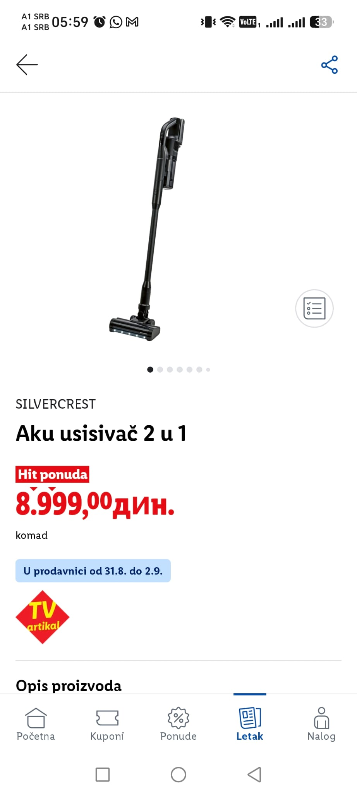 | 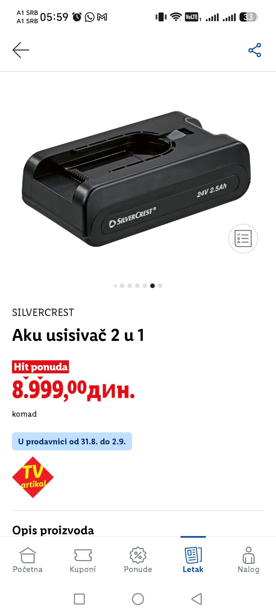 | 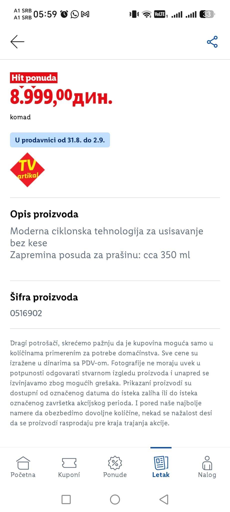 |

---

### 1.2 Rowenta RH98A7WO — X-Force Flex 12.60 Auto / Animal

| Podatak | Vrednost |
|---|---|
| **Cena MP** | 39.999 din |
| **Cena za gotovinu (−13 %)** | **34.999 din** |
| Snaga motora / napon | 320 W / 25,2 V |
| **Usisna snaga** | **150 AW** — najjači u ovom poređenju |
| **Posuda za prašinu** | **0,9 l** — najveća u ovom poređenju |
| Vreme rada / punjenja | 45 min / ~3 h |
| Stepeni snage | **4 nivoa + Boost okidač + automatska regulacija** po podlozi |
| Filtracija | ciklonska, zadržava do 99,9 % sitnih čestica |
| Buka | 82 dB |
| Težina | ~3 kg |
| Posebno | **Flex tehnologija** — savitljiva cev za čišćenje ispod nameštaja bez saginjanja; Power LED četka |
| Oprema | Power LED četka, **mini turbo četka za dlake ljubimaca**, uska mlaznica, četka za tapacirung, baza za punjenje |
| Garancija | 2 godine |
| **Referentna cena EU/HR** | **253–255 €** (nabava.net) ≈ 29.700 din; idealo.de od 239 € |

**Za koga:** kompletno domaćinstvo, kućni ljubimci, dosta tepiha, nameštaj pod kojim treba čistiti.

**Mane:** relativno bučan (82 dB), baterija se puni 3 h, srpska cena je oko 18 % iznad regionalne.

⚠️ **Nema mokro pranje.** Deklaracija u prodavnici glasi „Štapni usisivač" (šifra 126574), bez rezervoara za vodu i bez nastavka za mop — isključivo suvo usisavanje. Isto važi i za oba Bosch modela i za Silvercrest. **Nijedan usisivač iz ove ponude ne zamenjuje uređaj za pranje poda** (Philips OneUp / Vileda).

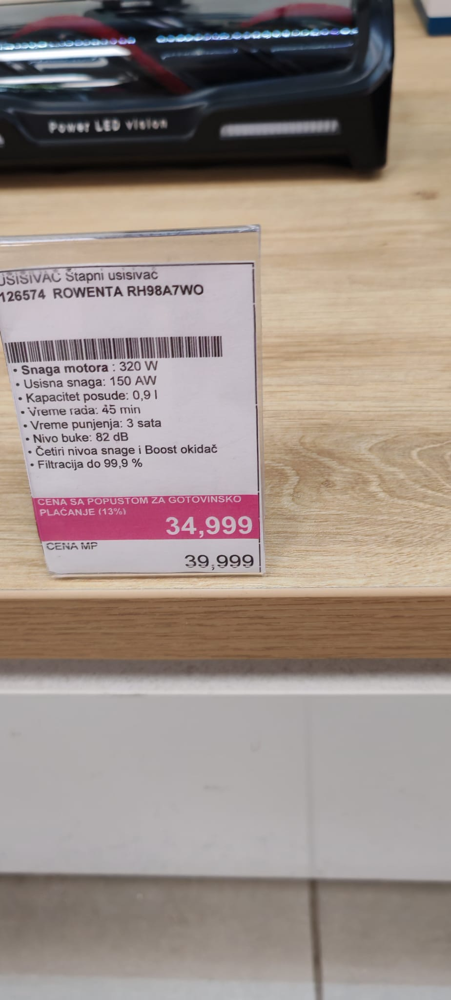

---

### 1.3 Bosch BCS711XXL — Unlimited 7

| Podatak | Vrednost |
|---|---|
| **Cena MP** | 42.999 din |
| **Cena za gotovinu (−12 %)** | **37.990 din** |
| Preporučena MP cena (Bosch RS) | 47.990 din |
| Motor / četka | TurboSpin / AllFloor DynamicPower Brush sa LED |
| Režimi | 3 (Eco / auto / turbo) |
| Vreme rada / punjenja | 40 min / **5 h** (najsporije punjenje) |
| **Posuda za prašinu** | **0,3 l** — najmanja u ovom poređenju |
| Baterija | zamenljiva 3,0 Ah, **Power for All Alliance** (deli se sa alatima) |
| Težina | 2,9 kg (najlakši) |
| Buka | 82 dB |
| Garancija | **10 godina na motor** |
| Ocena | Bosch RS: 4.9/5 (1.338 ocena) |
| **Referentna cena EU** | **od 269 €** (idealo.de) ≈ 31.500 din |

**Nezavisna recenzija (Expert Reviews, UK):** „A good cleaner lacking some essential modern features"

- Prednosti: jak u pukotinama, uredno pražnjenje, sistem zamenljivih baterija.
- Zamerke: **slabija usisna snaga, nema anti-tangle četku (kosa se namotava), bazične kontrole bez displeja.**

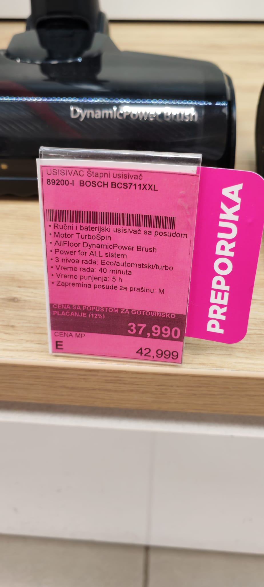

---

### 1.4 Bosch BBS921TBA — Unlimited 9

| Podatak | Vrednost |
|---|---|
| **Cena MP** | 50.999 din |
| **Cena za gotovinu (−12 %)** | **44.999 din** |
| Vreme rada / punjenja | do 60 min (3,0 Ah) / **3 h** |
| Posuda za prašinu | 0,4 l **sa kompresijom** — do 50 % ređe pražnjenje |
| Filtracija | **HEPA, >99,99 %** — najbolja za alergičare |
| Četka | MicroClean, uklanja >99,9 % prašine do 0,3 µm; **anti-tangle valjak (3× manje namotavanja kose)** |
| Kontrole | **LED displej** — 3 režima (Turbo/Auto/Eco) + preostalo vreme rada |
| Težina | 3,3 kg (najteži) |
| Buka | 80 dB |
| Garancija | 10 godina na motor |
| Ocena | Testberichte.de: **1,8 „gut"**; Amazon.de 4,2/5 (60 mišljenja) |
| **Referentna cena EU** | **369,99 €** ≈ 43.300 din — srpska cena je fer |

**Zamerka iz testa:** glasan (80 dB).

**Napomena:** na `bosch-home.rs` model je označen kao „Proizvod više nije dostupan" — kraj životnog ciklusa, otud i akcijska cena. Servis i rezervni delovi ostaju dostupni preko BSH-a.

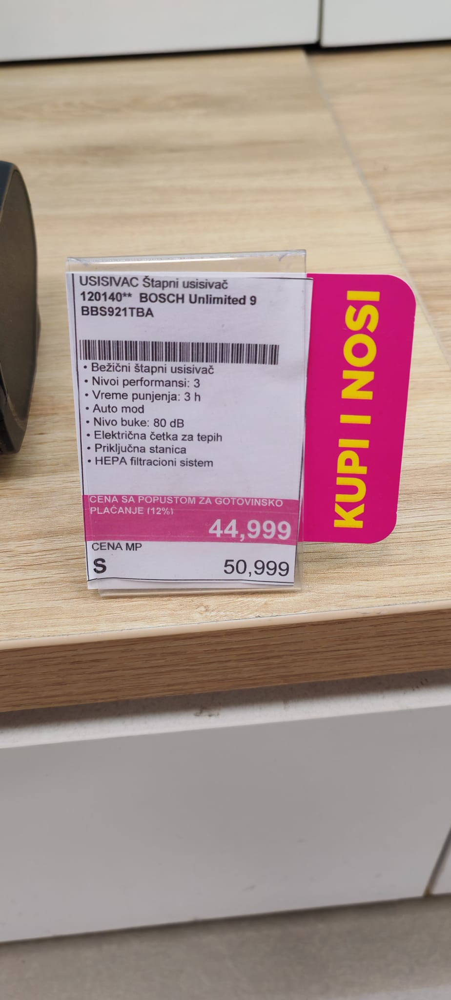

---

### 1.5 Rowenta RH6A75WO — X-Pert 7.60 🏆 najbolja vrednost

| Podatak | Vrednost |
|---|---|
| **Cena (gotovinsko, akcija do 6.9.)** | **16.399 din** |
| Druga deklaracija (02.08.–31.08., druga prodavnica) | 16.099 din — razlika samo 300 din |
| **Najniža cena u prethodnih 30 dana** | **18.940 din** → današnja cena je **2.541 ispod** minimuma ✅ |
| „Redovna MP cena" na deklaraciji | 42.352 din — fiktivno sidro |
| Akcijska MP (bez gotovinskog popusta) | 19.293 din |
| ID / brend | 1201750 / ROWENTA |
| Snaga | **140 W**, 18,5 V |
| Posuda za prašinu | 0,44 l |
| Vreme rada | do 45 min |
| Težina | **1,2 kg kao ručni usisivač** |
| Osvetljenje | LED za dubinsko čišćenje podova, tepiha i staza |
| Napajanje | bežično (aspirateur sans fil) |
| Servis | Rowenta „15 godina dostupnih rezervnih delova" |

**Za koga:** sekundarno usisavanje u domu gde je pranje poda glavna rutina; stan sa pretežno tvrdim podovima; brzo čišćenje mrvica i prašine bez vađenja velikog usisivača.

**Prednosti:** jedini uređaj u celoj listi čija je akcijska cena stvarno ispod 30-dnevnog minimuma; 1,2 kg u ručnom režimu je izuzetno lako; brend sa servisnom mrežom.

**Mane:** posuda od 0,44 l je duplo manja od RH98A7WO (0,9 l) — češće pražnjenje; 140 W je osetno manje od 150 AW flagship modela; nema anti-tangle četku ni displej.

| Deklaracija — septembar (16.399) | Deklaracija — avgust (16.099) | Pakovanje |
|---|---|---|
| 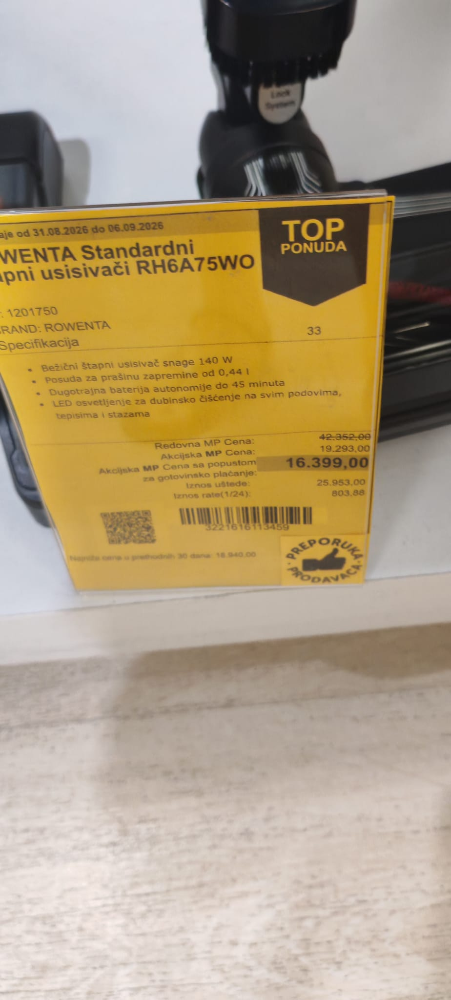 | 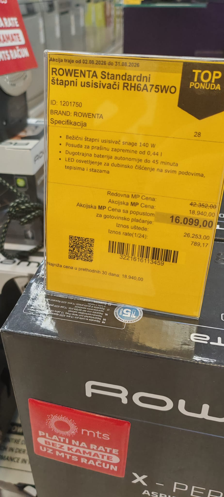 | 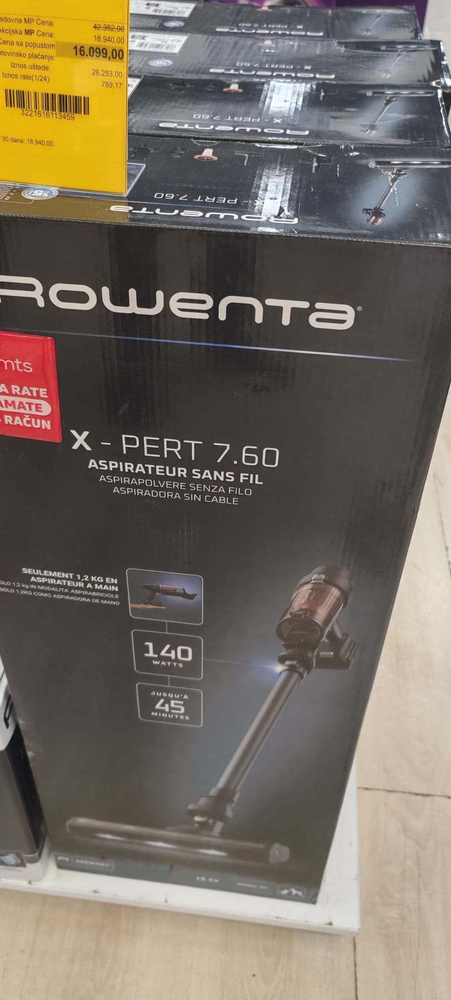 |

---

### 1.6 Rowenta RH9AD1WO — X-Force Flex 13.60 Animal Aerospin Aqua (2u1 usisavanje + brisanje) ❌

| Podatak | Vrednost |
|---|---|
| **Cena (gotovinsko, akcija do 6.9.)** | **56.399 din** |
| **Najniža cena u prethodnih 30 dana** | **47.058 din** → današnja „TOP PONUDA" je **9.341 din SKUPLJA** ❌ |
| „Redovna MP cena" na deklaraciji | 96.940 din — fiktivno sidro (UVP proizvođača je 649,99 € ≈ 76.000 din) |
| Akcijska MP (bez gotovinskog popusta) | 66.352 din |
| Deklarisana „ušteda" | 40.541 din — neistinita |
| ID / brend | 1201751 / ROWENTA |
| Usisna snaga | **150 AW** (isto kao RH98A7WO) |
| Posuda za prašinu | 0,55 l |
| Vreme rada | do 60 min |
| Filtracija | 99,99 % |
| Displej | pametni — nivo baterije, snaga, upozorenje za čišćenje filtera |
| Regulacija | automatsko podešavanje usisne snage po vrsti poda |
| Težina | 1,6 kg kao ručni |
| **Mokra funkcija** | **Aerospin Aqua glava** — „2-in-1 Saug-Wisch-Düse" sa **2 rotirajuća mikrofiber mopa**, ručna regulacija dotoka vode, **4 mopa u kompletu** |
| **Referentna cena EU** | **od 389 €** (Saturn DE) ≈ 45.500 din → srpska cena **+24 %**; Rowenta.de 399,99–450,99 € |

**Ključno ograničenje:** Aerospin **ne skuplja prljavu vodu.** Rezervoar kvasi rotirajuće mikrofiber mopove, a prljavština završava **u krpi** — nema rezervoara za prljavu vodu kao kod Philips OneUp. To je vlažno brisanje uz istovremeno usisavanje, a ne pranje sa ekstrakcijom.

**Zašto se ne isplati:** Philips OneUp (23.999) + Rowenta RH6A75WO (16.399) = **40.398 din** — **16.001 din jeftinije**, uz pravu ekstrakciju prljave vode i zaseban usisivač koji radi nezavisno od mopa.

**Kada bi imao smisla:** samo ako je prioritet **jedan uređaj umesto dva** (mali stan, nema mesta za odlaganje) i prihvata se brisanje krpom. Tada čekati povratak na ~47.000 din.

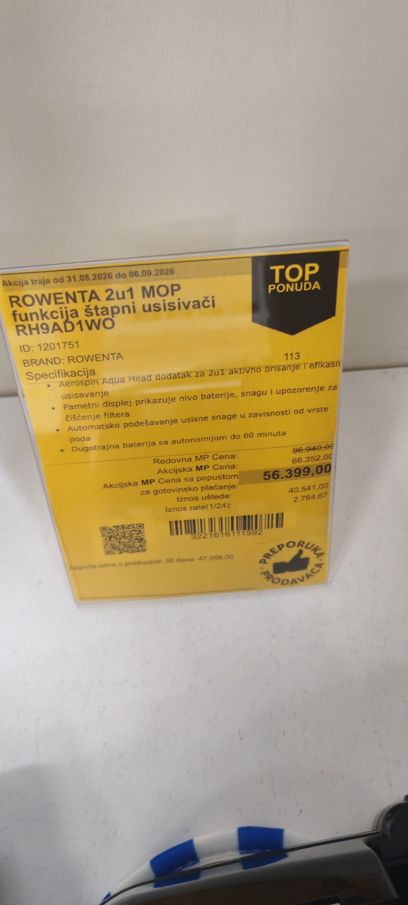

---

### 1.7 Rowenta RH2038WO ❌ ne po ovoj ceni

| Podatak | Vrednost |
|---|---|
| **Cena — deklaracija B (31.08.–06.09.)** | **28.999 din** |
| **Cena — deklaracija A (03.08.–31.08., druga prodavnica)** | **24.799 din** → razlika **4.200 din (+17 %)** |
| **Najniža cena u prethodnih 30 dana** | 27.058 din (isto na obe nalepnice) → cena od 28.999 je **1.941 iznad** sopstvenog minimuma ❌ |
| „Redovna MP cena" | 45.999 din (identična na obe nalepnice) |
| ID / brend | 1201749 / ROWENTA (identičan na obe) |
| Vreme rada | do 45 min |
| Osvetljenje | snažno LED |
| Cev | fleksibilan dizajn |
| Posuda | „velikog kapaciteta za manje pražnjenja" (nije brojčano navedeno) |
| Regulacija | inteligentno čišćenje sa automatskim podešavanjem usisne snage |

**Presuda:** oprema je dobra, cena od 28.999 nije. Dva razloga, oba nezavisna:

1. **Iznad je sopstvenog 30-dnevnog minimuma** (27.058) — po definiciji nije akcija, bez obzira na oznaku „TOP PONUDA".
2. **Isti model postoji za 24.799** na drugoj deklaraciji. Pošto su slike iz različitih prodavnica **i** različitih meseci, ne zna se da li je razlika vremenska ili prostorna — ali u oba slučaja znači isto: **ne kupovati po 28.999 bez provere druge prodavnice.**

⚠️ **Nelogičnost na deklaraciji:** obe nalepnice nose isti ID artikla, istu „redovnu cenu" (45.999) i isti 30-dnevni minimum (27.058). Ako su iz istog lanca, minimum od 27.058 je netačan — taj isti artikal je do 31.08. bio 24.799.

| Deklaracija B (28.999) | Deklaracija A (24.799) |
|---|---|
| 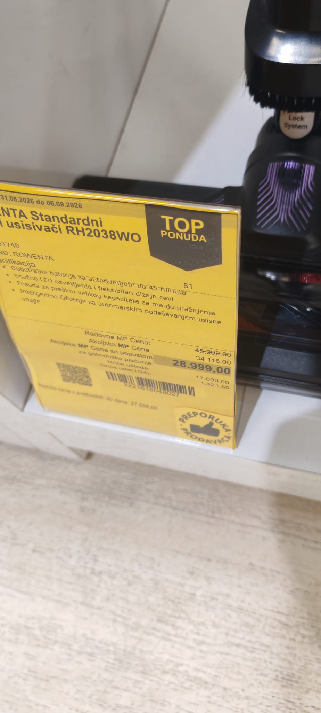 | 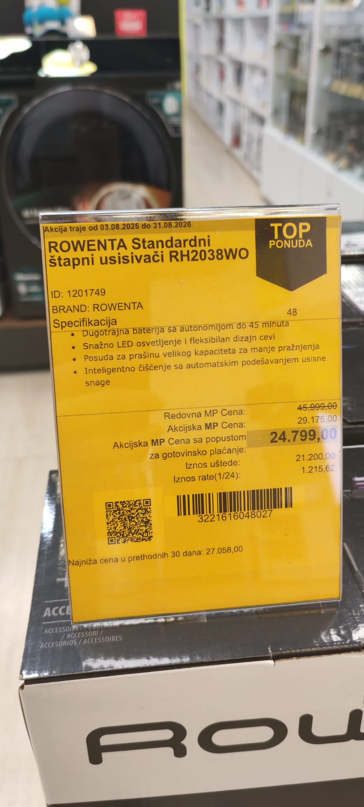 |

---

### 1.8 Gorenje SVC 216210 FFIIW — najbolji budžetski

| Podatak | Vrednost |
|---|---|
| **Cena (gotovinsko, akcija do 6.9.)** | **11.799 din** |
| ID / brend | 1210011 / GORENJE |
| **Autonomija** | **60 min** — najduže u budžetskoj klasi |
| Displej | **LED** — pregled podešavanja i statusa |
| Buka | 80 dB |
| Posuda | lako pražnjenje bez kese |
| Dizajn | beli |

**Presuda:** za 11.799 din dobija se autonomija od 60 minuta i LED displej — više nego Rowenta RH6A75WO (45 min, bez displeja) koja košta 4.600 din više. Nedostaje podatak o usisnoj snazi, što je razlog za oprez.

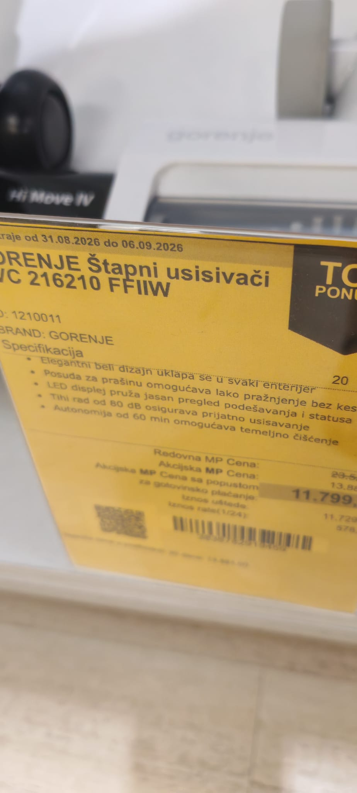

---

### 1.9 Gorenje SVC 259400 NES — 2u1 štapni/ručni

| Podatak | Vrednost |
|---|---|
| **Cena (gotovinsko, akcija do 6.9.)** | **15.699 din** |
| **Najniža cena u prethodnih 30 dana** | 17.635 din → **1.936 ispod** minimuma ✅ |
| „Redovna MP cena" | 23.528 din |
| ID / brend | 1266800 / GORENJE |
| Konstrukcija | **lako prelazi iz štapnog u ručni usisivač** |
| Četka | aktivna četka za podove |
| Napajanje | bežično |

**Presuda:** poštena akcija (ispod 30-dnevnog minimuma), ali Rowenta RH6A75WO za 700 din više nudi poznat brend, servis i 1,2 kg u ručnom režimu.

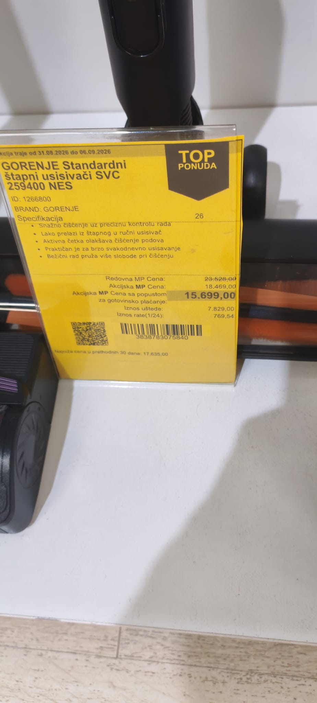

---

### 1.10 Gorenje SVC 252420 FFA

| Podatak | Vrednost |
|---|---|
| **Cena (gotovinsko, akcija do 6.9.)** | **17.799 din** |
| **Najniža cena u prethodnih 30 dana** | 20.822 din → **3.023 ispod** minimuma ✅ |
| „Redovna MP cena" | 35.293 din |
| ID / brend | 1246615 / GORENJE |
| Usisna snaga | 95 W |
| Protok vazduha | 16 l/s |
| Buka | 80 dB |
| Kontrola | kontrolno svetlo za status punjenja baterije |

**Presuda:** solidna specifikacija, ali za 17.799 din Rowenta RH6A75WO (16.399) je jeftinija i lakša. Prosečan izbor.

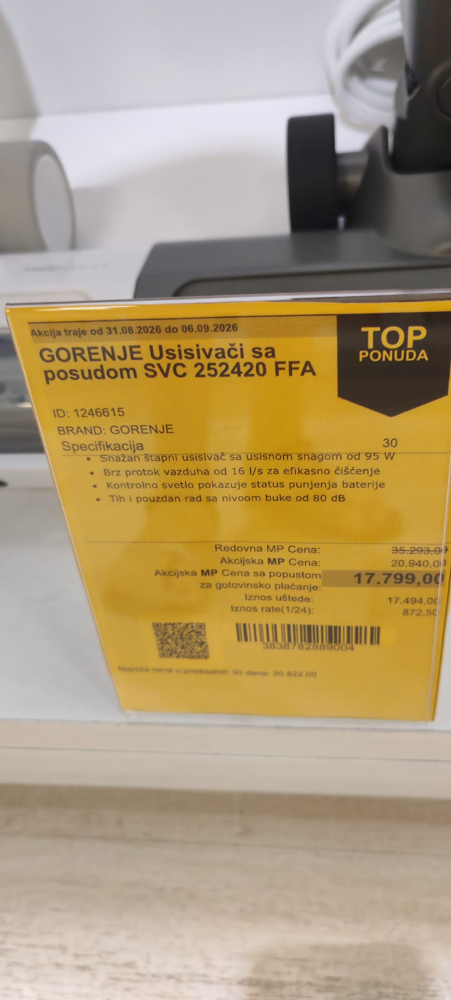

---

### 1.11 Hisense HVC 613410 BK ⚠️ najslabiji

| Podatak | Vrednost |
|---|---|
| **Cena (gotovinsko)** | **11.399 din** — ⚠️ akcija istekla 31.8. |
| **Najniža cena u prethodnih 30 dana** | 12.940 din |
| „Redovna MP cena" | 31.249 din |
| ID / brend | 1205114 / HISENSE |
| **Usisna snaga** | **samo 30 W** — najslabiji u celoj listi |
| Motor | 110 W |
| Protok vazduha | 11 l/s |
| Punjenje baterije | 4 h |
| Buka | 78 dB — najtiši |
| Ekran | LED |
| Filter | QuickClean |

**Presuda:** 30 W usisne snage je premalo za ozbiljno usisavanje. Gorenje SVC 216210 za 400 din više daje 60 min autonomije i LED displej. Izbegavati osim ako nije potreban vrlo tih uređaj.

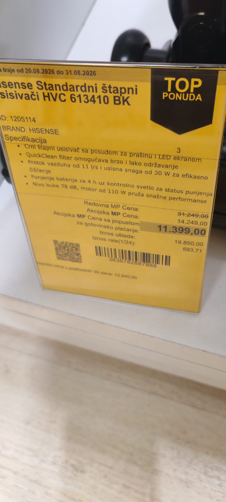

---

### 1.12 VOX — četiri modela (A16G, A06R, A18G, A22B)

⚠️ Svim VOX modelima je akcija istekla **31.8.2026** — navedene cene više ne moraju važiti.

| Model | Cena (gotovinsko) | Najniža u 30 dana | „Redovna MP" | Ključne specifikacije |
|---|---|---|---|---|
| **A16G** 🏆 | **7.999** | 9.411 | 14.374 | **150 W motor, usisna snaga do 11 kPa**, bežičan, lagan |
| A06R | 11.699 | 11.764 | 17.499 | do **50 min** rada, razni nastavci, kvalitetna filtracija |
| A18G | 12.799 | 12.940 | **49.249** ⚠️ | **ciklonska tehnologija + HEPA**, posuda velikog kapaciteta |
| A22B | **5.499** | — | 6.874 (−20 %) | posuda **0,6 l**, **2,2 kg**, uski nastavak, nastavak za tkanine — **sa kablom** |

**A16G je najbolji odnos u VOX liniji** — 150 W i 11 kPa za 7.999 din je najviše deklarisane snage po dinaru u celoj listi.

**A18G ima najgore sidro u dokumentu:** „Redovna MP cena 49.249 din" za VOX štapni usisivač nije realan broj ni u jednom scenariju — stvarna ušteda u odnosu na 30-dnevni minimum je 141 din.

**A22B je jedini sa kablom** u ovoj grupi — nema bateriju, pa nema ni degradacije baterije. Za auto, vikendicu ili kao rezervni.

| A16G | A06R | A18G | A22B |
|---|---|---|---|
| 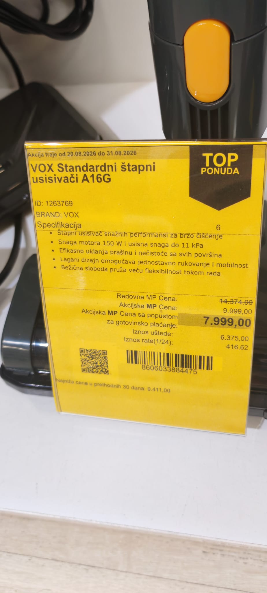 | 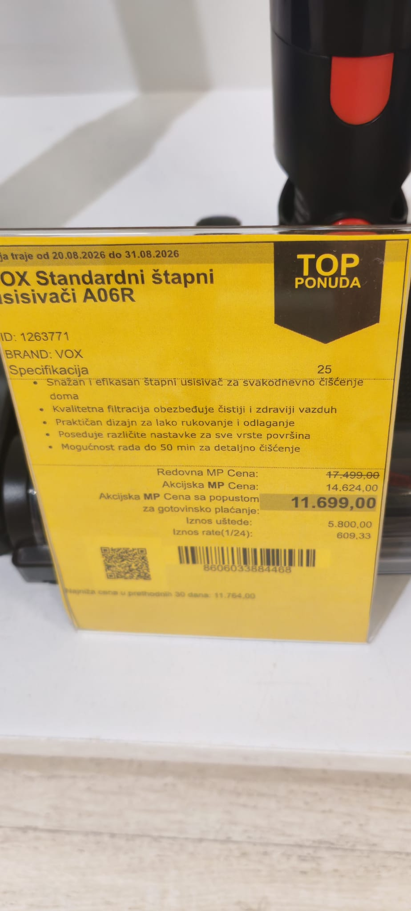 | 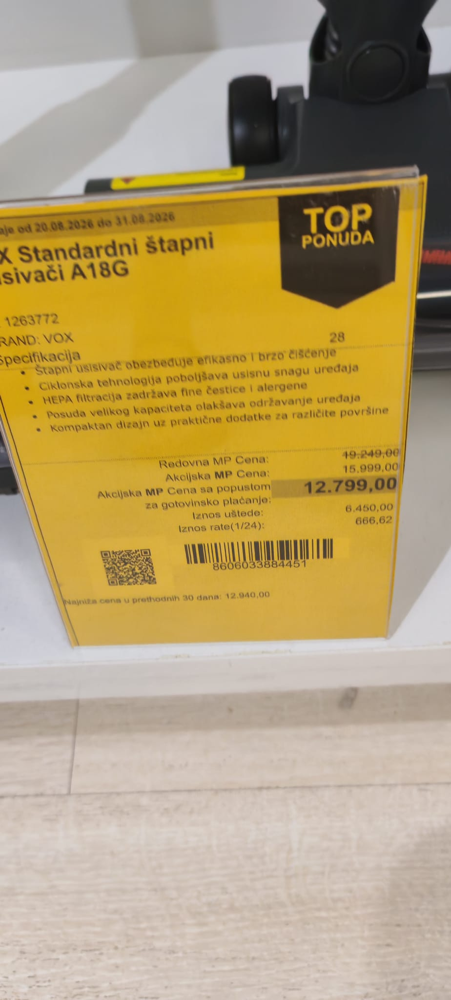 | 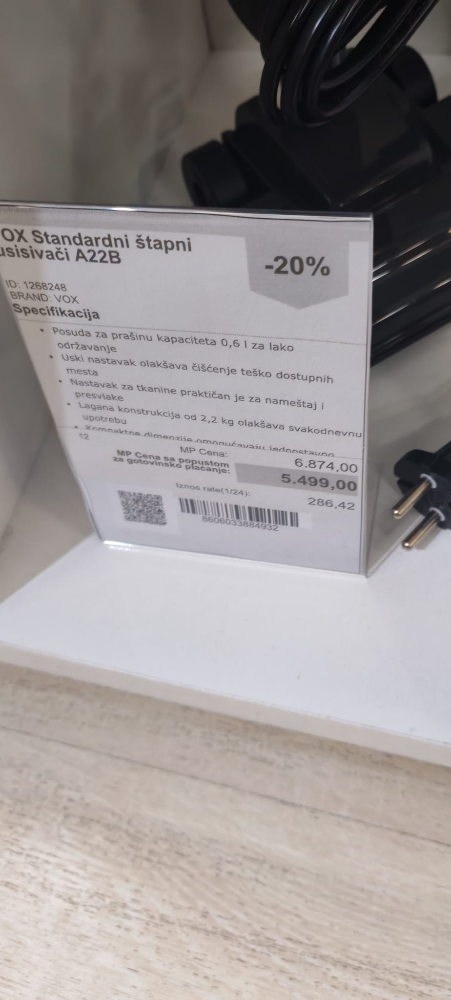 |

---

### 1.13 Midea 2u1 X6 — vidi kategoriju 3

Tehnomanija ga vodi pod „Štapni usisivači", ali tip na deklaraciji je „**2u1 MOP**" — to je uređaj za **pranje poda sa usisavanjem prljave vode**, ne suvi štapni usisivač. Obrađen je u [3.4 Midea Štapni usisivač 2u1 X6](#34-midea-štapni-usisivač-2u1-x6--konkurent-philipsu).

---

### Uporedna tabela — svi štapni usisivači

Sortirano po ceni. Svi su 🟡 **suvo usisavanje** i **nijedan ne pere pod** — osim RH9AD1WO, koji briše vlažnom krpom (ne ekstrahuje).

| Model | Cena | Najniža 30 dana | Snaga | Posuda | Rad | Punjenje | Filtracija | Posebno |
|---|---|---|---|---|---|---|---|---|
| VOX A22B | **5.499** | — | n/p | 0,6 l | **kabl** | — | n/p | 2,2 kg, nastavak za tkanine |
| VOX A16G | 7.999 | 9.411 | 150 W / **11 kPa** | n/p | n/p | n/p | n/p | bežičan, lagan |
| Silvercrest SASG 24 A1 | 8.999 | — | n/p (2 stepena) | 350 ml | 45 min (ECO) | n/p | EPA 10 | vadiva baterija, ❌ isteklo |
| Hisense HVC 613410 BK | 11.399 | 12.940 | ⚠️ **30 W** | n/p | n/p | 4 h | QuickClean | 78 dB (najtiši), LED ekran |
| VOX A06R | 11.699 | 11.764 | n/p | n/p | 50 min | n/p | n/p | razni nastavci |
| Gorenje SVC 216210 FFIIW | 11.799 | ~13.9k | n/p | n/p | **60 min** | n/p | n/p | **LED displej**, 80 dB |
| VOX A18G | 12.799 | 12.940 | n/p | veliki | n/p | n/p | **HEPA** | ciklonska tehnologija |
| Gorenje SVC 259400 NES | 15.699 | 17.635 | n/p | n/p | n/p | n/p | n/p | 2u1 štapni/ručni, aktivna četka |
| 🏆 **Rowenta RH6A75WO** | **16.399** | **18.940** ✅ | 140 W | 0,44 l | 45 min | n/p | n/p | **1,2 kg kao ručni**, LED |
| Gorenje SVC 252420 FFA | 17.799 | 20.822 | 95 W / 16 l/s | n/p | n/p | n/p | n/p | 80 dB, kontrolno svetlo |
| ❌ Rowenta RH2038WO | 28.999 | 27.058 ❌ | n/p | veliki | 45 min | n/p | n/p | flex cev, auto regulacija |
| Rowenta RH98A7WO | 34.999 | — | **150 AW** | **0,9 l** | 45 min | 3 h | 99,9 % | Flex cev, mini turbo četka |
| ❌ Bosch BCS711XXL | 37.990 | — | n/p | 0,3 l | 40 min | 5 h | HEPA | 10 g garancije motora |
| Bosch BBS921TBA | 44.999 | — | n/p (MicroClean) | 0,4 l + kompresija | **60 min** | 3 h | **HEPA >99,99 %** | anti-tangle, LED displej, 10 g |
| ❌ **Rowenta RH9AD1WO** | 56.399 | **47.058** ❌ | **150 AW** | 0,55 l | **60 min** | n/p | **99,99 %** | 🔵 Aerospin Aqua — briše krpom |

**Legenda:** ✅ = akcijska cena je ispod 30-dnevnog minimuma (stvarna akcija) · ❌ = akcijska cena je iznad 30-dnevnog minimuma (nije akcija) · n/p = nije naveden na deklaraciji.

**Razlika vs. EU cena** (gde je poznata): Bosch BBS921TBA **+4 %** · Rowenta RH98A7WO +18 % · Silvercrest +18 % · Bosch BCS711XXL +20 % · Rowenta RH9AD1WO **+24 %**.

---

## 2. Uređaji za čišćenje tapaciranog nameštaja

### Silvercrest SPR 450 A1 (Lidl) — sprej-ekstrakcioni uređaj

| Podatak | Vrednost |
|---|---|
| **Cena (Lidl SRB)** | **6.499 din** — „Hit ponuda", 31.8. – 2.9. |
| Šifra / IAN | 0544758 (IAN 544758_2510) |
| Snaga | 450 W |
| **Usisna sila** | **15 kPa (15.000 Pa) / 38 AW** |
| Rezervoar čiste vode | 1 l |
| Rezervoar prljave vode | 0,6 l |
| Protok spreja / pritisak | 0,38 l/min / 2,2 bara |
| Dužina creva / kabla | 1,5 m / 3 m |
| Težina | ~2,8 kg |
| Zaštita | klasa II, IPX4 |
| Oprema | četka za tepihe, mlaznica za tapacirung i dušeke, **100 ml sredstva za čišćenje** |
| **Referentna cena EU** | **ispod 80 €** na Lidl.de (≈ 9.400 din) |

**Namena:** tapacirani nameštaj, tepisi, dušeci, tekstil, sedišta u automobilu.

**Prednosti:** odvojeni rezervoari za čistu i prljavu vodu, dve mlaznice, lagan i prenosiv, izuzetno povoljan.

**Mane:** **ne usisava suvu prašinu** (površinu treba prvo usisati običnim usisivačem); mali rezervoari znače često dolivanje — uređaj je namenjen mrljama i manjim/srednjim površinama, ne neprekidnom čišćenju velikih prostora.

**Savet:** koristiti isključivo nisko-penušavo sredstvo za ekstrakcione mašine; voda u rezervoaru ne sme biti toplija od 40 °C; testirati postojanost boje na skrivenom delu.

| Proizvod | Opis i šifra |
|---|---|
| 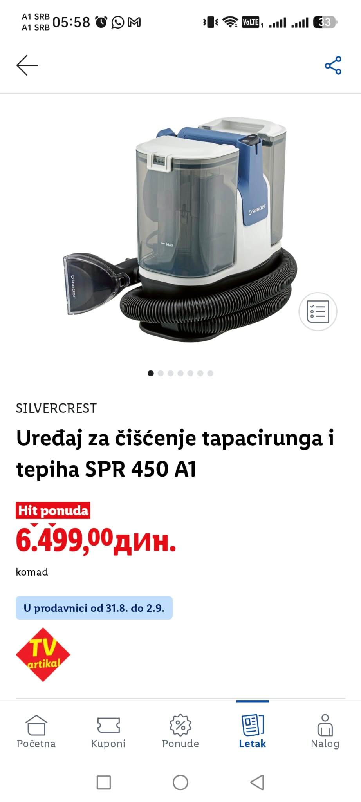 | 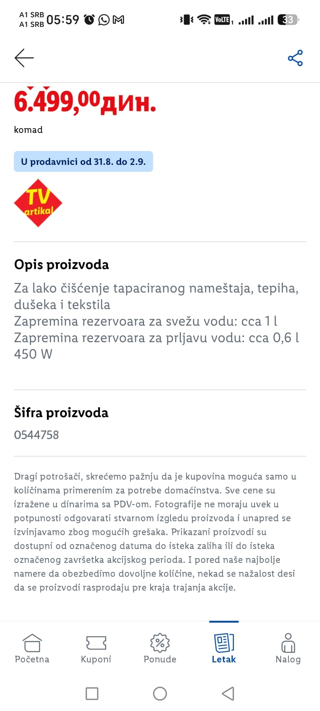 |

---

## 3. Pranje i ribanje poda

### 3.1 Philips OneUp Serija 5000 XV5113/01 — električni mop

| Podatak | Vrednost |
|---|---|
| **Cena MP (Gigatron)** | 27.909 din |
| **Cena za gotovinsko plaćanje** | **23.999 din** |
| EAN | 8720389035975 |
| Vreme rada / punjenja | **70 min** / 4 h |
| Boja | plava |
| Tehnologija | **patentirana OneUp** — istovremeno ispušta čistu i usisava prljavu vodu |
| Rezultat | 2× čistiji podovi 2× brže od klasičnog mopa; uklanja do **99,9 % bakterija** |
| Dizajn | bežičan, zglob koji se rotira **360°** |
| **Ocena kupaca (Philips)** | **4.8/5, 146 recenzija, 97 % preporučuje** |
| **Težina** | **1,9 kg** — duplo lakši od Midee X6 (3,8–4 kg) |
| **Usisna snaga** | ⚠️ **Philips je ne objavljuje** — OneUp nije usisivač, motor služi za povlačenje vode |
| Baterija | 2 Ah, Li-Ion, punjenje 4 h |
| Dimenzije / radna širina | 140 × 35 × 12 cm / **35 cm** |
| Pokrivenost | **50 m² po rezervoaru**; preporučeno za stan do 125 m² |
| Garancija | 2 godine |
| Nezavisne ocene (Coolblue) | **8,5/10 iz 179 recenzija** |
| Dodatna garancija (Gigatron) | +1 g: 1.869 din / +2 g: 3.788 din |
| **Referentna cena EU** | **od 142,90 €** (idealo.de) ≈ 16.700 din — **srpska cena je ~44 % viša** |

**Potrošni materijal (računati u trošak):**

- Zamenljivi podni brisači `XV1882/10` / `XV1882/20` — perivi u mašini, traju do 6 meseci
- Sredstvo za čišćenje poda `XV1892/02` — punjenje za oko 40 upotreba, zamenjuje do 3 boce običnog deterdženta

**Za koga:** svakodnevno pranje tvrdih podova bez kofe, cediljke i mokrog poda posle.

**Mane:** znatno viša cena nego u EU; zavisnost od potrošnog materijala; nije za tepihe.

#### Kako Philips zapravo riba — mehanika i nezavisni test

⚠️ **Philips nema rotirajuću četku.** Koristi **statični brisač (mop pad)** koji se vuče po podu; „patentirana OneUp tehnologija" znači da uređaj **automatski održava optimalnu vlažnost brisača** — nanosi čistu vodu i istovremeno usisava prljavu. Rotacija od 360° u specifikaciji odnosi se na **zglob drške**, ne na četku. Poređenja radi, Midea X6 ima **motorizovani valjak na 2000 o/min** koji mehanički riba.

**Rezultati nezavisnog testa (Expert Reviews):**

| Vrsta prljavštine | Rezultat |
|---|---|
| Zasušene mrlje od kafe | ✅ nestale iz **par prelaza** |
| Crveno vino | ✅ **jedan potez** dovoljan |
| Ukorenjene / tvrdokorne mrlje | ✅ dobro, uz **viši stepen vlažnosti** |
| **Zasušeno blato** | ⚠️ mrlju skida, ali **čvrste čestice samo razgurava po podu** |
| Prosuto sa komadićima (npr. prosuta činija pahuljica) | ❌ **ne može da izađe na kraj** |

**Zaključak testa, doslovno:** *„to je samo mop i uopšte ne može da usisava"* — i **sam Philips preporučuje da se pod prvo usisa.**

**Šta to praktično znači:** Philips je odličan na **rastvorljivoj** prljavštini (kafa, vino, masnoća, tragovi obuće) jer je rastvara vodom i odmah usisava. Slab je na **čvrstoj** prljavštini (mrvice, blato, pesak, komadići) — nju gura ispred sebe ili puni brisač.


| Uređaj u prodavnici | Detalj uređaja | Deklaracija i cena |
|---|---|---|
| 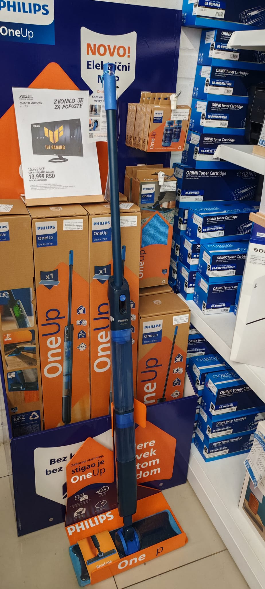 | 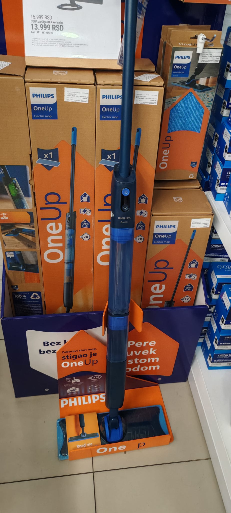 | 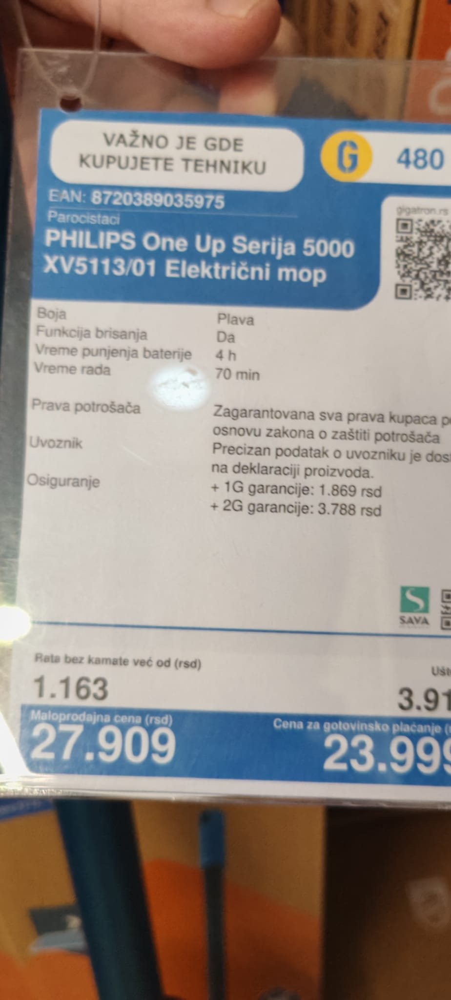 |

---

### 3.2 Vileda Steam Plus — parni mop

| Podatak | Vrednost |
|---|---|
| Cena bez PDV (Gigatron) | 17.449 din |
| **Cena sa PDV / akcija** | **14.999 din** |
| Šifra | 4023103229716 |
| Snaga (serija Steam Plus) | 1.550 W — **na struju, sa kablom** |
| Vreme zagrevanja | **~15 sekundi** |
| Efekat | uništava do **99,9 % bakterija i virusa** — samo parom, bez hemikalija |
| Glava | trouglasta, obrtna — dohvata uglove i ispod nameštaja |
| Krpa | perivi mikrofiber jastučić, pere se na 60 °C |
| Ocene korisnika | oko 3,5/5 — podeljena iskustva |

**Nezavisna recenzija — prednosti:** bez hemikalija; spreman za rad za 15 s; lagan; trouglasta glava odlična za uglove; rezervoar traje oko 20 min neprekidnog rada; drška se skida pa lako staje u ormar; perivi jastučić smanjuje tekuće troškove.

**Nezavisna recenzija — mane:**

- **Kratak kabl** — u većim prostorijama stalno se menja utičnica (najčešća zamerka)
- **Samo jedan mikrofiber jastučić u pakovanju** — rezervne treba kupiti odmah
- Nastavak za tepihe je vrlo osnovan; dubinsko čišćenje tepiha nije njegova jača strana
- Kod nekih korisnika drška ne naleže savršeno (zamerka na izradu)
- Tvrdokorne, ukorenjene mrlje često ostaju

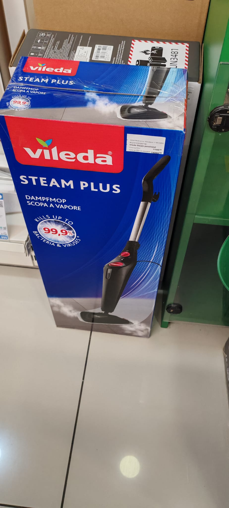

---

### 3.3 Gorenje SC 1200 W — paročistač ✅ zamena za Viledu

| Podatak | Vrednost |
|---|---|
| **Cena (gotovinsko, akcija do 6.9.)** | **9.799 din** |
| **Najniža cena u prethodnih 30 dana** | 11.528 din → **1.729 ispod** minimuma ✅ |
| „Redovna MP cena" | 15.293 din |
| ID / brend | 1140072 / GORENJE |
| Snaga | 1.200 W |
| Efekat | para odstranjuje do **99 %** nečistoća |
| Zagrevanje | **25 sekundi** |
| Rezervoar | **350 ml** |
| Težina | **1,9 kg** |
| **U kompletu** | **2 mikrofiber krpe** |
| LED | indikator napajanja |

**Zašto zamenjuje Viledu Steam Plus:**

| | Gorenje SC 1200 W | Vileda Steam Plus |
|---|---|---|
| Cena | **9.799** | 14.999 |
| Krpe u kompletu | **2** | 1 (glavna zamerka korisnika) |
| Rezervoar | 350 ml naveden | nije naveden |
| Težina | 1,9 kg | — |
| Zagrevanje | 25 s | 15 s |

Za **5.200 din manje** dobija se ista funkcija i duplo više krpa. Jedina prednost Vilede je 10 sekundi brže zagrevanje — što nije razlog za 5.200 din razlike.

⚠️ **I dalje važi:** paročistač **ne skuplja prljavu vodu**. Nije zamena za Philips OneUp, već jeftina dopuna za dezinfekciju parom bez hemikalija (kupatilo, kuhinja, dom sa malom decom).

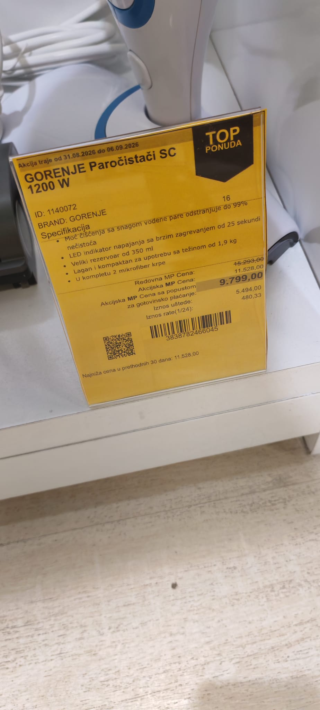

---
### 3.4 Midea Štapni usisivač 2u1 X6 — konkurent Philipsu

⚠️ **Tehnomanija ga vodi pod „Štapni usisivači", što je pogrešno usmerenje.** Tip na deklaraciji je „**2u1 MOP**" — ovo je **uređaj za pranje poda sa usisavanjem prljave vode**, iz iste klase kao Philips OneUp, a ne suvi štapni usisivač. Zato je ovde, u kategoriji 3.

| Podatak | Vrednost |
|---|---|
| **Cena (online / gotovinsko u prodavnici)** | **19.099 RSD** (−15 %) |
| **Najniža web cena u prethodnih 30 dana** | **12.077 RSD** → današnja cena je **7.022 din (+58 %) iznad** ❌ |
| „Redovna MP cena" | 22.469 RSD |
| Reklamirana „ušteda" | 3.370 RSD — u odnosu na fiktivno sidro |
| Web kredit | 24 rate, od 796 RSD/mesec |
| **Dostupnost** | ❌ **„Proizvod trenutno nije dostupan"** |
| Šifra artikla | 1204200 |
| Model / tip | X6 / **2u1 MOP** (2 u 1 štapni usisivač) |
| **Rezervoar čiste vode** | **600 ml** |
| **Rezervoar prljave vode** | **400 ml — zaseban** ✅ |
| **Usisna snaga** | **18 kPa** |
| Valjak | mikrovlakna, **2000 o/min** (Midea) / 600 o/min (Tehnomanija) |
| Snaga / napon | 120 W / 21,6 V |
| Baterija | 2500 mAh |
| Vreme rada | **35 min** |
| Punjenje | ~5 h |
| Težina | **3,8 kg** (Tehnomanija) / 4 kg (Midea) |
| Dimenzije | 260 × 290 × 1200 mm |
| Buka | 80 dB (Tehnomanija) / 78 dB (Midea) |
| Filter | HEPA (Tehnomanija) / sunđer (Midea) — ⚠️ podaci se razlikuju |
| Stopa povrata vode | **90 %** |
| Režimi | Standard / Strong / **Water Absorption** (skuplja vodu bez nanošenja nove) |
| Posebno | **samočisteći sistem na dugme**, self-traction (sam se vuče), boja siva |
| Uvoznik | DITEH TRADE EVOLUTION DOO, PROINTER-WEB DOO BEOGRAD |

**Zašto je važan:** ovo je **jedini drugi uređaj u celom dokumentu koji stvarno usisava prljavu vodu** u zaseban rezervoar. Time se ispravlja ranija tvrdnja da je Philips OneUp jedini takav. Dodatno ima nešto što Philips ne nudi: **samočišćenje na dugme** i **režim za skupljanje vode** bez nanošenja nove.

**Usisava i riba — istovremeno, u jednom prolazu.** To nije uređaj koji se prebacuje između „režima usisavanja" i „režima ribanja": valjak od 2000 o/min riba vlažan, a usis od 18 kPa u istom potezu povlači **i prljavu vodu i suvu prljavštinu** (mrvice, dlake) u rezervoar od 400 ml. Nema posude za prašinu — sve ide u prljavu vodu. Zato:

- ✅ **Tvrdi podovi** (pločice, laminat, parket, granit) — pokriva i suvo i mokro jednim prolazom, ne treba prvo usisavati
- ❌ **Tepisi i otirači** — nije za njih („do not take it near a mat"), kao ni Philips
- ❌ **Sofa, dušeci, stepenice, auto, police** — nema crevo ni nastavke
- ⚠️ Suva prašina u rezervoaru postaje mulj — rezervoar se prazni i ispira posle svake upotrebe

**Praktična posledica:** na tvrdim podovima **zamenjuje i mop i usisivač**, što je više od Philipsa (koji suvu prljavštinu samo delimično hvata u krpu). Ali **ne zamenjuje suvi usisivač za sve ostalo** — pošto imaš tekstilni nameštaj, drugi uređaj ti i dalje treba.

**Zašto ipak ne pobeđuje Philips:**

| | Philips OneUp | Midea X6 |
|---|---|---|
| Autonomija | **70 min** | 35 min — **dvostruko manje** |
| Težina | lakši | 3,8–4 kg |
| Ocene | **4.8/5, 146 recenzija, 97 % preporučuje** | **nijedna recenzija** |
| Dostupnost | dostupan | ❌ nije dostupan |
| Cena | 23.999 | 19.099 (ali 30-dnevni min. je 12.077) |

**Presuda:** ❌ **ne kupovati po 19.099 din — i ne može se kupiti ni da se hoće** (nema ga na stanju).

**Da je dostupna — da li bi bila bolji izbor od Philipsa?** Zavisi isključivo od cene, i odgovor nije isti u dva scenarija:

| Scenario | Presuda |
|---|---|
| **Po 19.099 (trenutna cena)** | ❌ **Ne.** Philips je samo 4.900 din skuplji, a daje **upola manju težinu** (1,9 vs 3,8–4 kg), **duplo veću autonomiju** (70 vs 35 min) i **325 stvarnih recenzija** naspram nijedne. Za 20 % veću cenu dobija se osetno bolji svakodnevni uređaj. |
| **Po 12.077 (30-dnevni minimum)** | ⚠️ **Uslovno da** — Philips tada košta duplo. Ali i dalje ne bezuslovno, vidi ispod. |

**Čak i po 12.000 din, Midea gubi na dve stvari koje su za *svakodnevno* pranje najvažnije:**

1. **Težina 3,8–4 kg protiv 1,9 kg.** Uređaj koji guraš svaki dan — dvostruka težina se oseti više nego bilo koja specifikacija. Philips je u klasi lakog mopa, Midea u klasi punog usisivača.
2. **35 minuta protiv 70.** Philips pokriva **50 m² po rezervoaru** i preporučen je za stan do 125 m². Ako pranje traje duže od 35 min, Midea staje nasred posla — a punjenje traje **5 sati**.

**Kada Midea po 12.000 jeste bolji izbor:**

- stan **do ~50 m²**, gde 35 minuta pokriva ceo posao iz jednog punjenja
- težina od 4 kg ti ne smeta
- vredi ti to što **skuplja i suvu prljavštinu u rezervoar** (Philipsu ona ide u krpu) i što ima **samočišćenje na dugme**

**Kada Philips ostaje bolji i po duploj ceni:**

- veći stan ili pranje duže od 35 minuta
- bitna ti je lakoća rukovanja
- ne želiš da budeš prvi korisnik modela bez ijedne recenzije i bez poznate servisne istorije kod nas

**Šta Midea rešava, a Philips ne:** Midea **stvarno usisava** — 18 kPa, skuplja prašinu, mrvice, krupniju prljavštinu i dlake ljubimaca **u rezervoar za prljavu vodu**, a ne u krpu kao Philips. Ima i **Water Absorption režim** (usisavanje bez nanošenja vode). Zato na **tvrdom podu Midea zamenjuje i mop i suvi usisivač** — dva uređaja u jednom. Philips to ne može.

**Šta ni Midea ne rešava:** u kompletu dolaze samo **posuda za odlaganje i alat za čišćenje rezervoara i valjka** — **nema creva, uske mlaznice ni nastavka za tapacirung**. Deklarisane površine su tvrdi podovi, drvo, granit i keramika. Znači: **sofa, dušeci, stepenice, auto i tepisi ostaju nepokriveni** i uz Mideu. Za njih i dalje treba nešto suvo — ali može biti mnogo jeftinije nego pun štapni usisivač (npr. VOX A22B za 5.499, koji ima nastavak za tkanine).

**Zbog toga je Midea po niskoj ceni jača opcija nego što na prvi pogled izgleda:**

| Kombinacija | Pokriva | Ukupno |
|---|---|---|
| Midea @12.077 + VOX A22B | tvrdi pod (mokro **i suvo**) + tapacirung | **17.576 din** |
| Midea @19.099 + VOX A22B | isto | 24.598 din |
| Philips + VOX A22B | tvrdi pod (mokro) + tapacirung, ali suvo usisavanje poda slabo | 29.498 din |
| Philips + Rowenta RH6A75WO | sve, uključujući tepihe | 40.398 din |

⚠️ Prve dve varijante rade **samo ako u stanu nema tepiha** — Midea na tepih ne ide.


**Kompromisi koje treba prihvatiti čak i po 12.000:** 35 minuta rada je malo za veći stan (Philips radi 70), 3,8 kg je osetno teže od običnog mopa, punjenje traje 5 h, i nema ni jedne korisničke recenzije — nepoznat je stvarni kvalitet izrade i trajnost.

**Provera pre kupovine:** podaci Tehnomanije i Midee se razlikuju u tri stavke (filter HEPA vs sunđer, valjak 600 vs 2000 o/min, težina 3,8 vs 4 kg) — tražiti deklaraciju u prodavnici.

---

## 4. Usisivači sa posudom (suvo, sa kablom)

### 4.1 Rowenta RO4B75EA — Compact Power XXL

| Podatak | Vrednost |
|---|---|
| **Cena (gotovinsko, akcija do 6.9.)** | **16.999 din** |
| **Najniža cena u prethodnih 30 dana** | 18.822 din → **1.823 ispod** minimuma ✅ |
| ID / brend | 1197481 / ROWENTA |
| Snaga | **900 W MAX** |
| Motor | High Efficiency Motor |
| **Filtracija** | **99,98 %** |
| Sistem | bez kese (posuda) |
| Mlaznica | „zeer efficiënte zuigmond" — visoko efikasna podna četka |
| Napajanje | **kabl** |

**Za koga:** ko ne želi bateriju koja stari i gubi kapacitet; veći stan gde jedno punjenje ne stigne da pokrije sve; alergičari (99,98 % filtracije po deklaraciji).

**Prednosti:** 900 W neprekidno bez pada snage kroz vreme rada; nema baterije koja se posle 3–4 godine menja; poštena akcija ispod 30-dnevnog minimuma.

**Mane:** kabl — vučenje uređaja i traženje utičnice; glomazniji za odlaganje od štapnog; nije praktičan za brzo čišćenje mrvica.

**U kontekstu tvog izbora:** ako ti usisavanje nije dnevna rutina, kabl smeta manje nego što se čini — a za 600 din više od Rowente RH6A75WO dobijaš znatno jači motor. Ali za „brzo dohvatiti i usisati" štapni je nenadmašan.

| Uređaj i pakovanje | Deklaracija i cena |
|---|---|
| 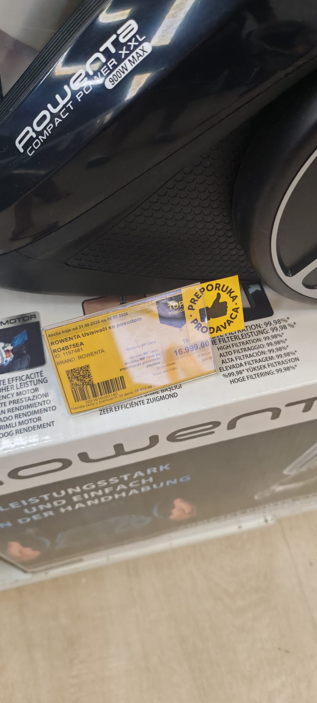 | 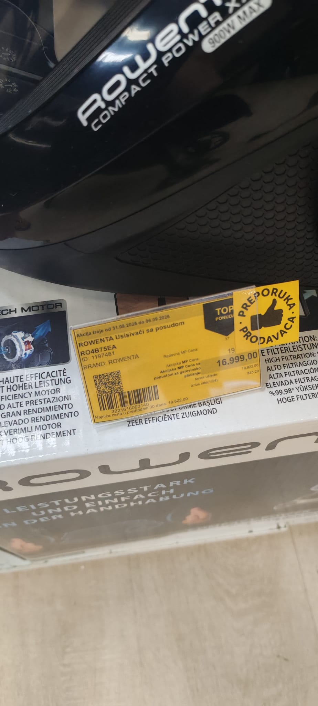 |

---

## 5. Usisivači za suvo i mokro usisavanje

⚠️ **Važno razgraničenje:** ovi uređaji **usisavaju prosutu tečnost** — ne peru pod. Nemaju mop, ne nanose vodu ni deterdžent na pod. Nisu alternativa Philips OneUp uređaju.

### 5.1 Rowenta IN3021F0 — suvo i mokro usisavanje

| Podatak | Vrednost |
|---|---|
| **Cena (gotovinsko, akcija do 6.9.)** | **13.999 din** |
| **Najniža cena u prethodnih 30 dana** | 16.469 din → **2.470 ispod** minimuma ✅ |
| Deklarisana „ušteda" | 13.882 din |
| Rata (1/24) | 686,21 din |
| ID / brend | 1246905 / ROWENTA |
| Namena | suvo usisavanje + usisavanje tečnosti |

**Presuda:** najjeftiniji ulaz u kategoriju i poštena akcija. Ima smisla za garažu, auto, podrum, terasu ili posle radova — ne za svakodnevno čišćenje stana.

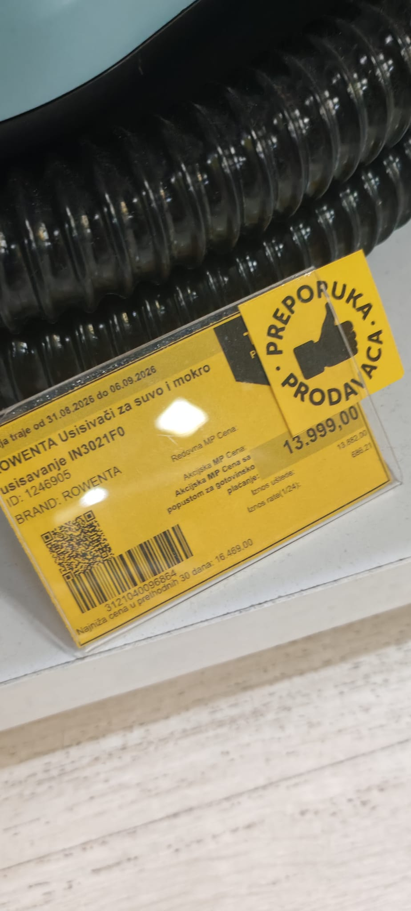

---

### 5.2 Kärcher WD 3 V-17/4/20 — referenca u klasi

| Podatak | Vrednost |
|---|---|
| **Cena za gotovinsko plaćanje (−20 %)** | **14.899 din** (sa nalepnice) |
| 🏆 **Najbolja cena na tržištu** | **10.189 din** (eponuda.com, 36 prodavnica) — **4.710 din jeftinije (−32 %)** |
| Cena za odloženo plaćanje | 18.624 din |
| Rata (1/24) | 776,00 din |
| ID / brend | 1180539 / KÄRCHER |
| **Posuda** | **17 l** |
| Namena | višenamenski usisivač — suvo i mokro |

**Presuda:** za 900 din više od Rowente IN3021F0 dobija se Kärcher — brend koji je u ovoj kategoriji standard, sa 17-litarskom posudom. Ako se već ulazi u kategoriju, ovo je uređaj koji traje.

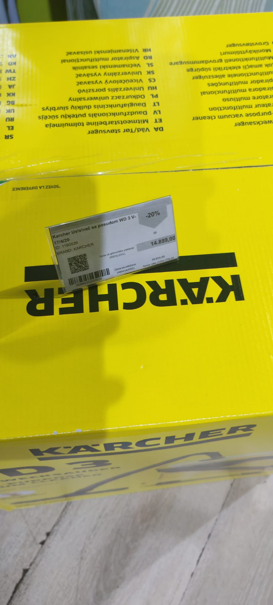

---

### 5.3 Rowenta IN5020F0 — usisivač sa vodenim filterom

| Podatak | Vrednost |
|---|---|
| **Cena (gotovinsko, akcija do 6.9.)** | **21.099 din** |
| **Najniža cena u prethodnih 30 dana** | 23.528 din → **2.429 ispod** minimuma ✅ |
| Deklarisana „ušteda" | 19.370 din |
| Rata (1/24) | 1.034,25 din |
| ID / brend | ...25459 / ROWENTA |
| Tehnologija | **vodeni filter** — prašina se veže za vodu umesto u kesu/filter |
| Namena | suvo usisavanje + mokro usisavanje |

**Za koga:** alergičari — vodeni filter zadržava sitne čestice bolje od standardnog filtera i ne izduvava prašinu nazad u prostoriju.

**Mane:** posle svakog usisavanja treba isprazniti i oprati posudu sa vodom — inače se javlja miris. To je dnevna obaveza, ne opciona.

**Presuda:** najskuplji u kategoriji 05 i najzahtevniji za održavanje. Ima smisla isključivo ako je alergija stvaran problem u domu.

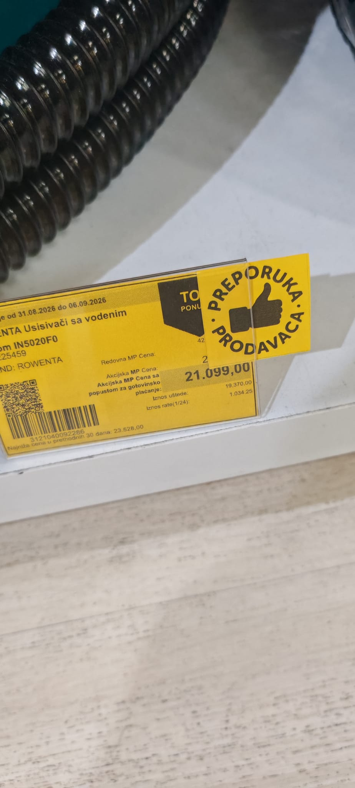

## 6. Alternative Midei X6 — pretraga tržišta (3u1 mokro-suvi perači poda)

Pretraga srpskog tržišta, septembar 2026: štapni uređaji koji **istovremeno usisavaju i peru pod sa ekstrakcijom prljave vode**, do 30.000 din, jači od Midee X6 (18 kPa).

### Rezultat: ništa ispod 30.000 din nije jače od 18 kPa

**18 kPa je plafon ove cenovne klase.** Da bi se prešlo preko toga, prelazi se i preko 40.000 din.

| Model | Cena | Usisna snaga | Do 30k? | Jači od Midee? |
|---|---|---|---|---|
| **Midea X6** (referenca) | 19.099 (min. 12.077) | **18 kPa** | ✅ | — |
| 🏆 **Xiaomi Truclean W30 Pro** | **27.990** | **18 kPa** | ✅ | ❌ isto, **ali bolji u svemu ostalom** |
| Tineco Floor One i5 Stretch | ~43.635 | ~20 kPa | ❌ | ✅ |
| Roborock F25 Black | **56.999** | **20 kPa** (450 o/min) | ❌ | ✅ |
| Dreame H14 Dual | ~44.183 | n/p | ❌ | verovatno |
| Roborock F25 ACE | 64.999–79.999 | 20 kPa + vruća voda 90 °C | ❌ | ✅ |
| Dreame H12 Pro | 66.377–105.099 | n/p | ❌ | ✅ |
| Dreame H15 Pro Heat / FoamWash | 82.999+ | n/p | ❌ | ✅ |

### 🏆 Najbolji nalaz: Xiaomi Truclean W30 Pro — 27.990 din

Ne pobeđuje Mideu na sirovoj usisnoj snazi (**oba 18 kPa**), ali je po svemu ostalom ozbiljno bolji uređaj — i, za razliku od Midee, **dostupan je**.

| | Midea X6 | **Xiaomi Truclean W30 Pro** |
|---|---|---|
| Cena | 19.099 (nije dostupan) | **27.990** ✅ dostupan |
| Usisna snaga | 18 kPa | 18 kPa — *izjednačeno* |
| **Motor** | 120 W | 🏆 **450 W** |
| **Autonomija** | 35 min | 🏆 **40 min** |
| **Samočišćenje** | hladnom vodom | 🏆 **vrućom vodom** |
| **Dizajn** | standardni | 🏆 **180° ravno spuštanje** — ide potpuno ispod nameštaja |
| **Protiv zamršavanja dlaka** | ❌ | 🏆 **4-stepeni anti-tangle sistem** |
| Režimi | 3 (Standard / Strong / Water Absorption) | 3 (Standard / Water-saving / …) |
| Servis i podrška u Srbiji | uvoznik DITEH/PROINTER | Xiaomi ima ustaljenu mrežu |
| Redovna cena | 22.469 | 39.999 → **na akciji 27.990** |

**Zašto je 180° ravno spuštanje bitno:** to je jedina stvar u ovoj klasi koja rešava čišćenje **ispod kreveta, sofe i kuhinjskih elemenata** — mesto gde ni Philips ni Midea ne stižu.

**Zašto je anti-tangle bitan:** kod mokro-suvih perača dlake se namotavaju na valjak i moraju se ručno seći. Četvorostepeni sistem je konkretna prednost u domu sa dugom kosom ili ljubimcem.

### Ako budžet može preko 30k

**Roborock F25 Black — 56.999 din, 20 kPa, valjak 450 o/min.** Prvi uređaj koji je stvarno **jači** od Midee. Skoro trostruko skuplji od Midee na akciji; ima smisla samo ako je pranje poda glavni prioritet u domaćinstvu i budžet nije ograničen.

### ⚠️ Usput otkriveno: isti uređaji su jeftiniji kod drugih trgovaca

Ceneovnici sa deklaracija iz kategorije 5 nisu najbolje cene na tržištu:

| Uređaj | Sa deklaracije (Tehnomanija) | Najbolja cena (eponuda.com) | Razlika |
|---|---|---|---|
| **Kärcher WD 3 V-17/4/20** | 14.899 | **10.189** | **−4.710 din (−32 %)** |
| Rowenta IN5020F0 | 21.099 | **18.989** | −2.110 din |
| Rowenta IN3021F0 | 13.999 | **12.599** | −1.400 din |

Ovo potvrđuje raniji zaključak: **cene sa deklaracija u prodavnici treba uvek proveriti na poređivaču pre kupovine.**

### Xiaomi W30 Pro vs Kärcher WD 3 — nisu konkurenti

Ovo je najčešća zamena pojmova u celom dokumentu. **Oba se zovu „usisivač za suvo i mokro", a rade suprotne poslove.**

| | **Xiaomi Truclean W30 Pro** (27.990) | **Kärcher WD 3 V-17/4/20** (10.189) |
|---|---|---|
| **Šta je** | perač poda sa usisavanjem | radionički usisivač (shop-vac) |
| **Pere pod** | ✅ **da** — nanosi vodu, riba valjkom, usisava prljavu | ❌ **ne može uopšte** — nema rezervoar za čistu vodu, mop ni deterdžent |
| „Mokro" znači | pere i skuplja svoju vodu | usisava tečnost **koja je već prosuta** |
| Snaga | 18 kPa / 450 W | **1.000 W**, znatno veći sirovi usis |
| Posuda | 600 ml čista + 400 ml prljava | **17 l** |
| Napajanje | bežično, 40 min | kabl **4 m** |
| **Crevo i nastavci** | ❌ nema — samo podna glava | ✅ **crevo 2 m + uska mlaznica + podna glava** |
| Funkcija duvanja | ❌ | ✅ da |
| Filter | — | jednodelni patronski, **bez zamene između suvog i mokrog** |
| Samočišćenje | ✅ vrućom vodom | ❌ ručno pranje posude |
| Za tepihe | ❌ | ⚠️ slabo — nema motorizovanu četku |
| Buka / gabarit | tih, uspravan | **bučan, glomazan** |

**Za tvoj prioritet (svakodnevno pranje poda): Xiaomi, bez konkurencije.** Kärcher pod ne može da opere — on samo usisava vodu koja je već na podu.

**Za teške poslove: Kärcher, bez konkurencije.** Pesak, šut, pepeo, staklo, poplava, auto, garaža, podrum, posle radova.

#### Ali: Kärcher je ozbiljan kandidat za *drugi* uređaj

Zbog **creva od 2 m i uske mlaznice**, Kärcher dohvata ono što ni Xiaomi ni Philips ne mogu: **sofu, fotelje, stepenice, uglove, auto**. A po ceni od **10.189 din** je **6.210 din jeftiniji od Rowente RH6A75WO**.

| Kombinacija | Ukupno | Pokriva | Ne pokriva |
|---|---|---|---|
| **Xiaomi W30 Pro + Kärcher WD 3** | **38.179** | tvrdi pod mokro+suvo, sofa, stepenice, auto, garaža, poplava | tepihe; nezgrapno za brzo dnevno usisavanje |
| Xiaomi W30 Pro + VOX A22B | 33.489 | tvrdi pod mokro+suvo, tapacirung, lako i brzo | tepihe, teške poslove |
| Philips + Rowenta RH6A75WO | 40.398 | **sve, uključujući tepihe**, najkomfornije | teške poslove |

**Mane Kärchera kao drugog uređaja:** kabl od 4 m, 17 l gabarit koji traži mesto za odlaganje, bučan je, i **nije praktičan da se dohvati zbog par mrvica**. Nema motorizovanu četku pa je slab na tepisima. I nije zamena za Silvercrest SPR 450 — ne raspršuje sredstvo, samo usisava, pa ne čisti tekstil dubinski.

**Presuda:** ako u domu nema tepiha, a ima auto, garažu ili dvorište — **Xiaomi + Kärcher za 38.179 din je najsposobnija kombinacija u dokumentu.** Ako je prioritet komfor svakodnevnog usisavanja i ima tepiha, ostaje Philips + Rowenta.


<sub>Izvori: eponuda.com, gigatron.rs, bigbang.rs, tehnomedia.rs, ananas.rs; specifikacije Xiaomi Truclean W30 Pro (BHR08GYEU), Roborock F25 i Kärcher WD 3 V-17/4/20 (kaercher.com). Pretraga izvršena 4.9.2026.</sub>

---

---

<sub>Cene i dostupnost sa fotografija snimljenih u avgustu i septembru 2026, <b>u više različitih prodavnica</b> — dve nalepnice za isti model ne moraju predstavljati promenu cene kroz vreme. Akcijski periodi sa nalepnica: 31.8.–6.9.2026 (Rowenta, Gorenje); 20.8.–31.8.2026 (VOX, Hisense — isteklo); 31.8.–2.9.2026 (Lidl — isteklo); Kärcher i VOX A22B bez navedenog roka (−20 %). Podaci za Midea X6 preuzeti sa tehnomanija.rs (stranica artikla 1204200, 4.9.2026) i midea.com. Podaci proizvođača preuzeti sa bosch-home.rs, philips.hr/philips.rs, rowenta.de, lidl.de i kompernass.com; nezavisne ocene i EU cene sa testberichte.de, expertreviews.co.uk, nabava.net, idealo.de, geizhals.de, saturn.de, lidl.best i muskirecenziraj.com. Podaci „najniža cena u prethodnih 30 dana" preuzeti su direktno sa deklaracija u prodavnici.</sub>
